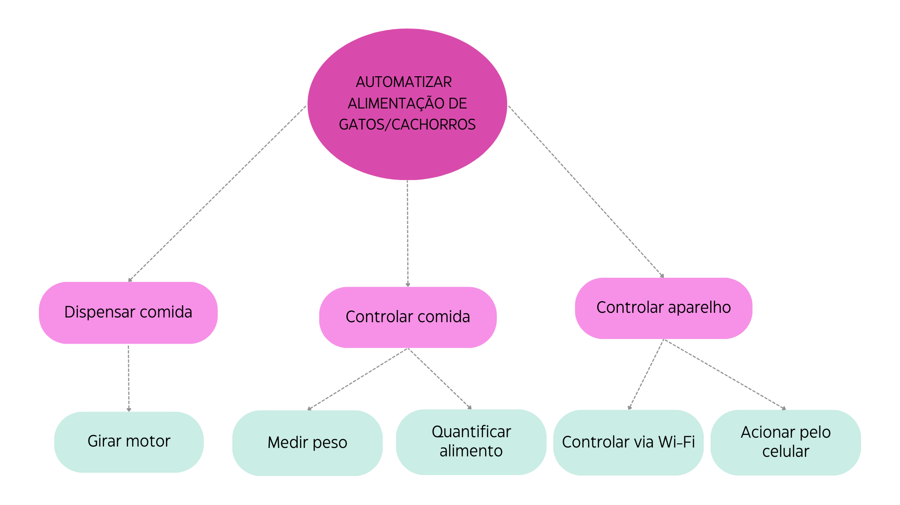
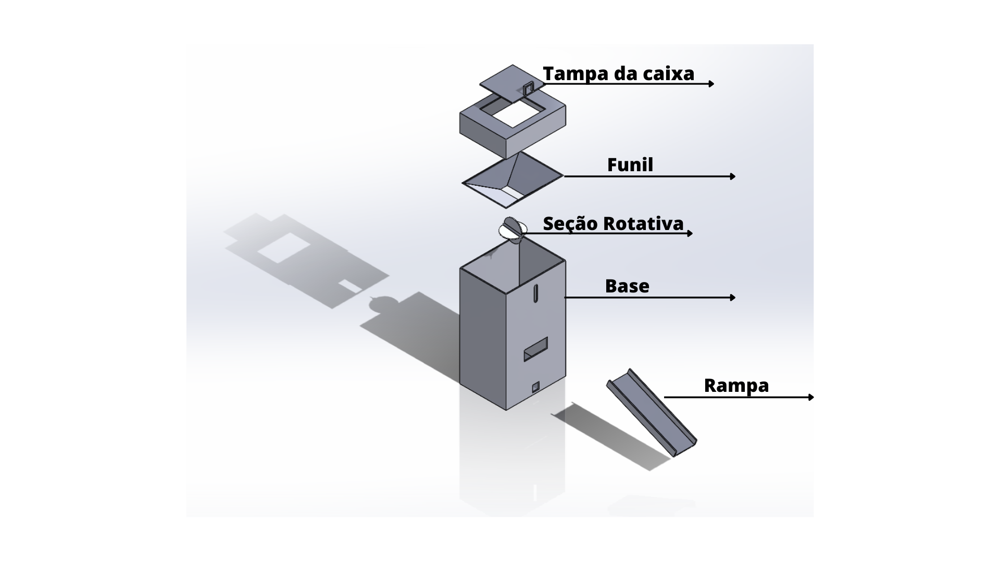
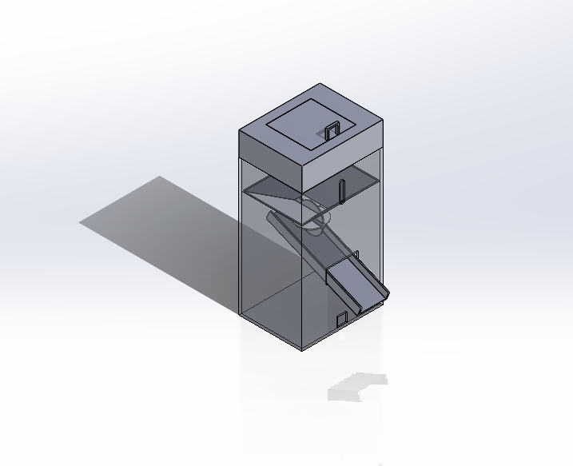

# CONCEIVE 
	
## INTRODUÇÃO

Com a constante evolução do mundo moderno, a vida está se tornando cada vez mais acelerada, levando as pessoas a passarem menos tempo em casa. Com isso, se  torna mais desafiador ter um animal de estimação, uma vez que a alimentação dos animais pode ser prejudicada devido à ausência dos tutores, seja devido a viagens ou trabalhos, e isso pode acarretar em problemas de saúde como a obesidade ou  desnutrição. 

Desta forma, esse projeto tem como objetivo explorar a importância e os benefícios que um alimentador inteligente pode oferecer, tanto para os animais quanto para seus tutores. Visando a praticidade e flexibilidade para os cuidadores, busca-se  desenvolver um produto que atenda as necessidades de ambas as partes, a fim de proporcionar uma melhor qualidade de vida.

O objetivo  deste projeto é desenvolver um alimentador para animais domésticos, como gatos e cachorros,  de forma funcional e prática. Esse dispositivo funcionará  conectado via Wi-Fi,  permitindo o controle do usuário em qualquer lugar  na   liberação de  alimento, tendo como ênfase a praticidade. Ademais, o alimentador também contará com uma balança, responsável por mensurar a porção alimentar dispensada, bem como um sensor ultrassônico  de distância para medir a quantidade de comida ainda disponível.

## Definição do projeto: 

Este projeto tem como objetivo a compreensão e o domínio de técnicas  de eletrônica. 
	
O alimentador funcionará, possuindo uma reserva de comida que estará localizada na parte superior e será  direcionada através de um funil para a seção rotativa. A integração com um servo motor nessa seção rotativa é fundamental para uma dispensa precisa de comida, assegurando que ela seja distribuída na quantidade e maneira adequada. Além disso, essa mesma seção contará  com um sensor, que, conectado via Wi-Fi ao aplicativo de celular, será responsável pela detecção do nível de comida disponível, transmitindo essa informação ao tutor do animal.

Após o alimento passar pela seção rotativa, ele será direcionado para um reservatório equipado com uma célula de carga, responsável por medir a quantidade exata de comida dispensada. Esses dados serão transmitidos para o aplicativo de celular. Essa funcionalidade será projetada para permitir que o dono do animal acompanhe a quantidade de comida liberada, garantindo que não seja nem insuficiente, nem excessiva.
##### Gráfico com a Estrutura Funcional do Projeto

O projeto será concretizado utilizando o polímero PLA, por meio do processo de impressão 3D. O esboço inicial do projeto foi criado no aplicativo SolidWorks, o que possibilita visualizar a disposição dos componentes na estrutura final, com exceção dos componentes eletrônicos, que não estão representados no esboço.

Esboço em  vista explodida:
##### Figura 1 - Esboço do Produto em vista explodida

Esboço do produto:
##### Figura 2 - Esboço do Produto 

## Materiais necessários: 
 Para a sua elaboração, será necessário os seguintes componentes: 

- Servo motor
- Esp8266
- Célula de carga
- Sensor HC-SR04

O servo motor é um equipamento eletromecânico empregado para movimentar com exatidão um objeto, permitindo que faça rotações em ângulos ou deslocamentos específicos, assegurando a precisão de sua posição e a constância de sua velocidade. No projeto, ele exercerá um papel crucial como um dos componentes mais essenciais do sistema. Sua principal responsabilidade será garantir a distribuição precisa da comida, assegurando que 80g de ração sejam dispensados no compartimento apropriado por meio de uma rotação completa de 360 graus.

Assim como o servo motor, o sensor ultrassônico  de distância também possuiu um papel essencial no projeto, é ele quem irá medir a quantidade de alimento disponível no reservatório. O modelo mais adequado para essa função é o HC-SR04 que consiste em um emissor e um receptor.Esse sensor   é capaz  de realizar medições precisas  que variam de 2 centímetros a cerca de 4 metros, com uma precisão de aproximadamente 3 milímetros.Ele opera emitindo sinais ultrassônicos que são projetados no objeto alvo e, em seguida, detectando o retorno desses sinais. Além de suas características técnicas, o HC-SR04  é amplamente utilizado devido à sua simplicidade de uso e custo benefício que oferece.

Para realizar a medição da porção liberada pelo usuário, o projeto contará com uma célula de carga posicionada externamente ao sistema. Essa célula de carga garantirá ao tutor   que a quantidade   de alimento dispensada está correta. A implementação do projeto utilizará uma célula de carga com capacidade de 10kg,  a decisão de empregar esse sensor de carga para medir a quantidade de ração no projeto é uma escolha prática, garantindo  segurança e a precisão.

O elemento central para o funcionamento deste projeto será o microcontrolador ESP8266. Este módulo WiFi é amplamenteutilizado devido a sua popularidade e sua capacidade compacta e completa. O ESP8266 incorpora um processador poderoso, tornando-o apto para a integração com sensores e outras aplicações específicas. Ele desempenhará um papel fundamental no projeto, agindo como a peça central que conecta todos os componentes e envia suas informações para um aplicativo de celular. Essa conexão é essencial para o funcionamento do alimentador, pois ocorre por meio da rede Wi-Fi.

## Conclusões finais 
Este projeto visa aprofundar o conhecimento e domínio das técnicas de eletrônica.Pretendendo entregar  no final um trabalho plenamente funcional que atenda aos objetivos  estabelecidos, contribuindo  para a compreensão e aprimoramento do conhecimento de  eletrônica. Além disso, o objetivo é concluir este projeto antes do final do mês de outubro,  para garantir o êxito na realização de todas as etapas.