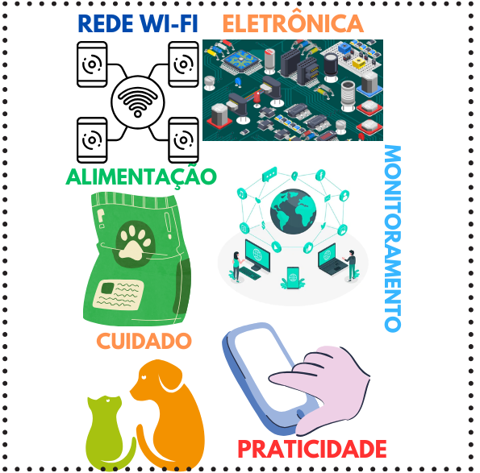
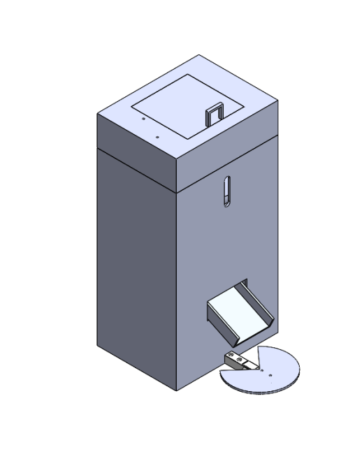
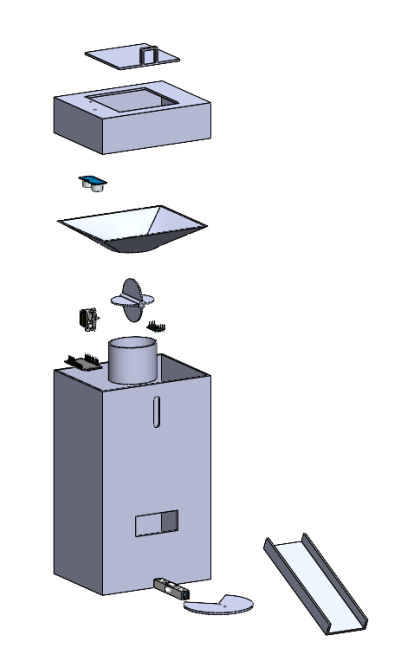
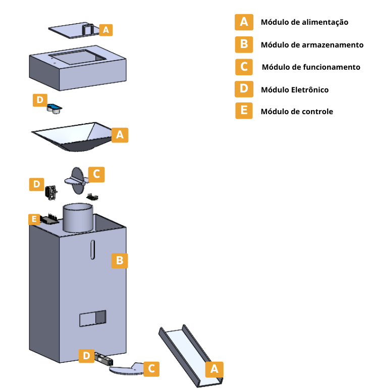
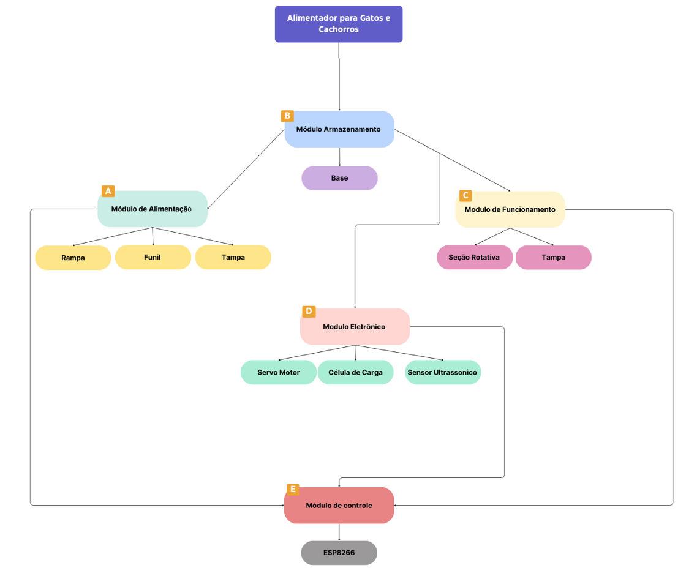
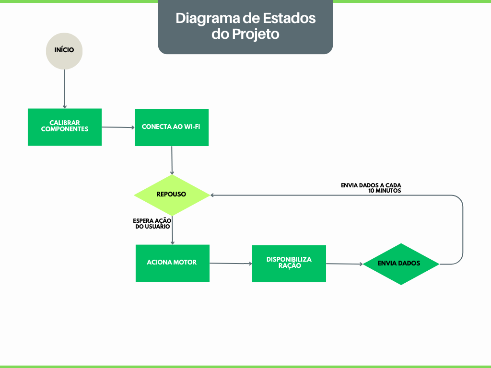
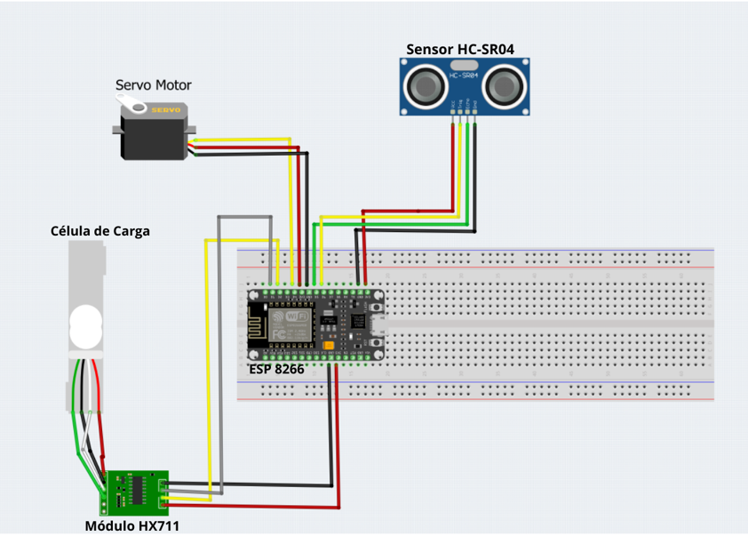
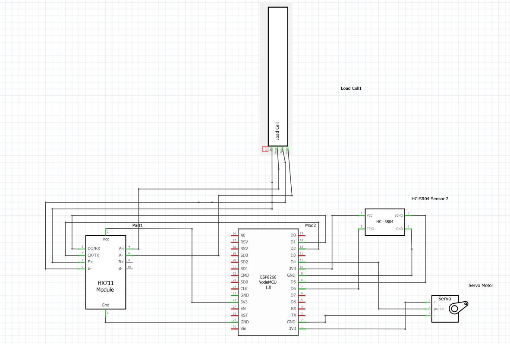
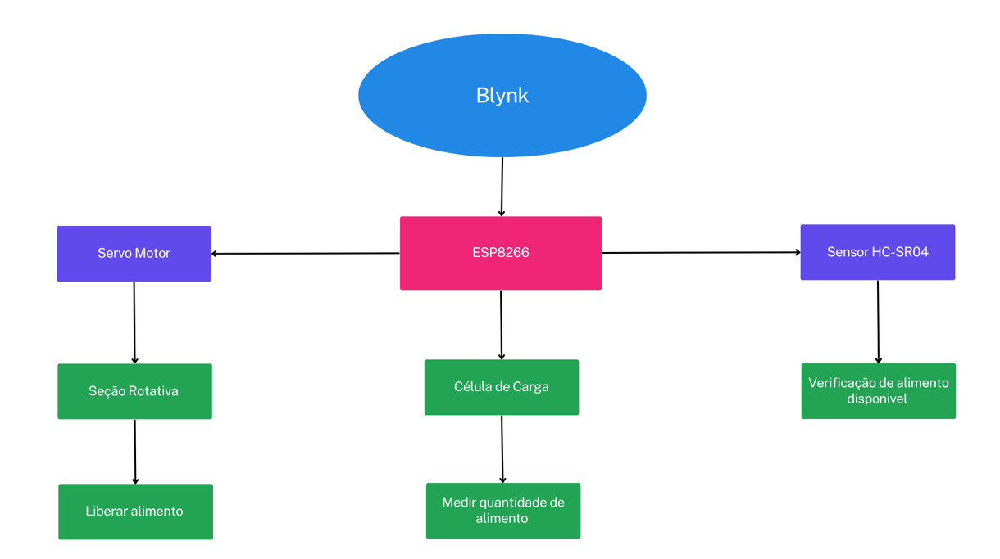
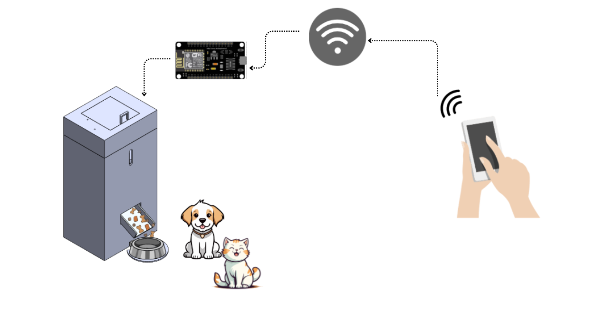

# Design

# Alimentador  inteligente  para Gatos e Cachorros

Após a fase inicial da  concepção, na qual uma visão estrutural do projeto é desenvolvida, torna-se necessário  avançar para a etapa de design, em que ocorre a integração de recursos tecnológicos ao projeto, buscando uma visão mais concreta e coesa para sua realização. Durante esse processo, foram elaborados o painel do produto,  o desenho definitivo,  a montagem dos componentes eletrônicos e o diagrama de funcionamento. Tais medidas foram tomadas com o objetivo de possibilitar a materialização efetiva do produto.

## Painel do produto 

O painel do produto desempenha um papel fundamental na comunicação dos conceitos e ideias associados ao projeto, fornecendo uma representação clara e visual dos principais elementos do trabalho, servindo como um resumo visual que destaca os aspectos importantes  do  projeto. 
Na elaboração deste painel buscou-se  colocar em evidência os pontos chaves do alimentos de gatos e cachorros, apresentando a qualquer pessoa o que o projeto busca fazer.

 ### Figura 1- Painel do Produto

## Esboço do Produto

O desenho do alimentador de gatos e cachorros foi desenvolvido no software de CAD 3D SolidWorks, em que se elaborou um produto que pudesse  atender  todos os requisitos funcionais, ao mesmo tempo que fosse estéticamente atraente. Para a sua realização levou-se em consideração os componentes eletrônicos a serem utilizados, para que não houvesse erros na sua montagem, que poderiam resultar em falhas no funcionamento ou desempenho inadequado do produto.

Para a sua criação foram  necessárias algumas  modificações em relação  ao esboço da primeira fase do projeto. Estas modificações incluíram o design do funil e a introdução de um prato específico para a célula de carga. Essas alterações foram necessárias pois, notou-se que ao encaixar a seção rotativa no funil, havia o risco da ração derramar para os lados durante a rotação. Para resolver esse problema, foi projetada uma estrutura em forma de elipse que se acopla à seção rotativa internamente. Já a criação do prato para a célula de carga foi realizada
para permitir que o alimento seja colocado sobre a balança, servindo como base para o recipiente que conterá a comida.

O produto será impresso pela impressora 3D em material polimérico PLA. Para a sua montagem será utilizado cola instantânea de  alta resistência para as partes  impressas fixas, parafuso e porcas 3M para a fixação dos componentes eletrônicos e dobradiças para a tampa.  

### Figura 2- Esboço do Produto

 

 ### Figura 3- Esboço interno Produto
  
   

 ### Figura 4- Vista Explodida 

Como o aplicativo SolidWorks é  designado para modelagem 3D, não foi possível fazer as conexões dos componentes, por isso eles foram colocados apenas de forma ilustrativa para verificar onde cada um  irá   ficar.

## Arquitetura do Projeto 
Na elaboração do projeto, foi utilizado uma arquitetura modular, na qual as subfunções foram transformadas em módulos independentes. O resultado final consiste em uma composição de vários blocos, cada um desempenhando funções específicas, permitindo uma montagem mais flexível e eficiente.

### Figura 5- Vista Explodida com os Módulos
 

* Módulo de alimentação (A): Desempenha um dos papéis mais importante no projeto, ele é composto pela  tampa, funil e rampa que desempenham  funções essenciais na entrada, armazenamento e distribuição do alimento. A tampa tem a função de proteger o alimento, impedindo a entrada de insetos, sujeira  e outros detritos. O funil tem a função de direcionar com o alimento armazenado para a rampa. No último componente, a  rampa desempenha o papel  da  condução do alimento até o recipiente do animal  de forma correta. 

* Módulo de armazenamento (B): Este módulo desempenha um papel fundamental no sistema, servindo como a base sólida que abriga todos os componentes, desde a parte funcional até a eletrônica. A base é responsável por sustentar e armazenar os componentes, garantindo assim sua funcionalidade, segurança e estética.

* Módulo de funcionamento( C ): Este módulo está fisicamente interligado com os módulos A,  D e E. O funil serve como a base de fixação para a seção rotativa, cujas operações são controladas pelo microcontrolador. A seção rotativa é fixada na base do funil e conectada a um servo motor, cujo movimento é controlado pela ESP8266. A função desta parte é dispensar a comida, direcionando-a com precisão para que seja liberada sobre a rampa. Além disso, o prato  está conectado a uma célula de carga, igualmente ligada à ESP8266. A função desse prato é permitir que o alimento seja colocado sobre a balança, servindo como base para o recipiente que conterá a comida.

* Módulo Eletrônico (D): Este módulo é fundamental para o funcionamento integral do projeto, pois abriga os  componentes essenciais para seu funcionamento,como  o servo motor, a célula de carga e o sensor ultrassônico. Este módulo está interconectado com os módulos C e E. O servo motor desempenha o papel de fornecer o movimento para seção rotativa. A célula de carga é responsável por medir a quantidade de alimento dispensado, já o sensor ultrassônico é responsável por monitorar a quantidade de alimento disponível no reservatório.Todos esses componentes estão interligados ao módulo principal, a ESP8266, que controla as operações do sistema como um todo, garantindo o  funcionamento eficaz. 

* Módulo de controle(E) : Este módulo desempenha um papel central no projeto, pois é ele quem controlará todos os componentes eletrônicos. Sua principal função é controlar as informações do módulo D, possibilitando a interação por meio da internet a partir  de dispositivos móveis. 

### Figura 6- Fluxograma do Projeto

O Diagrama de Estados é uma ferramenta essencial para apresentar o comportamento de um sistema em diferentes estados, auxiliando na identificação das condições que ocasionam a transição entre esses estados. Isso, por sua vez, proporciona uma compreensão do funcionamento e controle do projeto. 

 ### Figura 7- Diagrama de Estados 
 

## Montagem dos Componentes Eletrônicos

A etapa de montagem dos componentes eletrônicos desempenha um papel fundamental no processo de desenvolvimento de projetos. Ela é essencial para visualizar a organização dos componentes, e também para garantir o funcionamento adequado do sistema. A etapa de montagem dos componentes eletrônicos tem como objetivo criar uma representação  do projeto, permitindo que seja possível a visualização de como os elementos se encaixam e se relacionam entre si, ajudando  na detecção de problemas.
Para a realização desta parte, foi utilizado um softwares de design de circuitos eletrônicos para organizar a disposição dos componentes eletrônicos. 

### Figura 8- Montagem dos Componentes Eletrônicos 

Nesta montagem foram utilizados todos os componentes do projeto integrado à ESP8266, ela  foi realizada no aplicativo Fritzing para ver a conexão de cada componente.
### Figura 9- Esquematico 
 

A configuração dos componentes será realizada utilizando a linguagem C++ por meio do aplicativo Arduino IDE, uma plataforma de desenvolvimento integrado utilizado para programar placas. A montagem do circuito será executada em uma placa de fenolite, que é um material  laminado industrial utilizado para  o isolamento elétrico. 

## Diagrama de Funcionamento 

O diagrama de funcionamento desempenha um  importante papel na compreensão e implementação de um projeto, proporcionando uma visão abrangente das interações envolvidas e facilitando a análise estruturada do processo. Para a criação deste diagrama foi analisada a forma como o projeto operará de maneira clara e simplificada. Além disso, o aplicativo escolhido para essa finalidade é o Blynk,  que é uma  uma plataforma projetada para facilitar a criação, implantação e controle remoto  de dispositivos eletrônicos na Internet das Coisas (IoT).  Com o Blynk, é possível monitorar um microprocessador em tempo real a partir de qualquer local e personalizar a interface de controle de acordo com as preferências individuais.

### Figura 10- Diagrama de Funcionamento 

 
### Figura 11- Ilustração de Funcionamento do Projeto
