# IMPLEMENT
## Alimentador de Gatos e Cachorros

Após a conclusão da fase de design, na qual os recursos tecnológicos foram delineados, avança-se para uma etapa crucial do projeto: a implementação dos requisitos previamente estabelecidos nas fases anteriores.Transformando os conceitos inicialmente concebidos no papel se materializam em resultados tangíveis e funcionais.A implementação desdobrou-se em três processos distintos, cada um desempenhando um papel fundamental no sucesso do projeto. Primeiramente, ocorreu a concretização da parte eletrônica, na qual cada componente foi programado individualmente. Em paralelo, foi realizada a simulação do servo motor e do sensor ultrassônico com o auxílio do aplicativo Tinkercad.

A segunda etapa envolveu a criação e configuração do aplicativo, que desempenha um papel central na interação do usuário com o sistema. Por fim, a fase de montagem consolidou todos os elementos do projeto, sendo cada passo cuidadosamente conduzido para garantir a coesão e a eficácia do sistema como um todo.

Este percurso, que abrangeu desde a programação individual dos componentes até a montagem final, culminou na criação de um produto que atende integralmente aos requisitos estabelecidos, oferecendo resultados palpáveis e alinhados com a visão inicial do projeto.

### Implementação do código no Tinkercad 
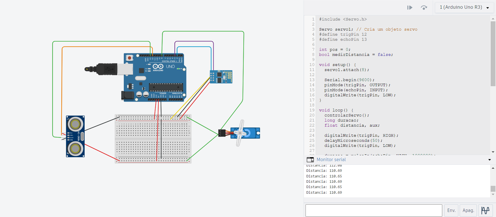

Para realizar a simulação, empregou-se uma combinação de um Arduino e uma ESP8266. Essa escolha foi motivada pela ausência, na biblioteca do aplicativo Tinkercad, de uma configuração adequada para a ESP8266, que necessitava de conexões específicas.

### Código empregado para cada componente 

* Sensor  HC-SR04 
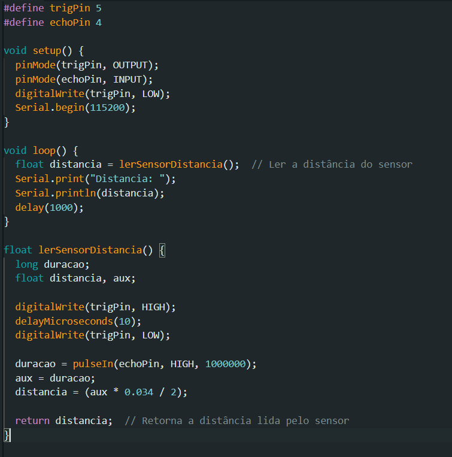
 * Servo motor 
 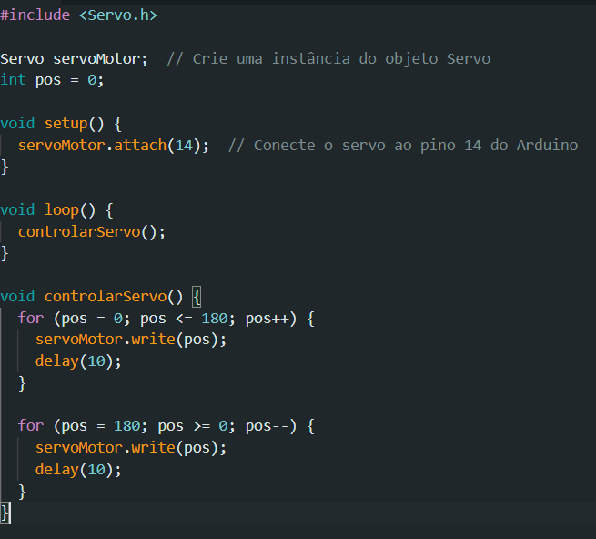
* Célula de carga 
 

Após concluir a programação de todos os componentes, procedeu-se aos testes individuais com a ESP8266 antes de sua integração.Durante os testes com o sensor ultrassônico, identificou-se a necessidade de implementar um divisor de tensão. Isso se deve ao fato de o sensor ultrassônico operar com 5V, enquanto a ESP8266 utiliza uma tensão de 3,3V. Conectar o sensor diretamente à ESP poderia resultar em uma tensão excessiva para o microcontrolador, potencialmente causando danos a ambos os componentes. Os resistores escolhidos para compor o divisor de tensão foram de 5000Ω e 10000Ω.

### Divisor de tensão
 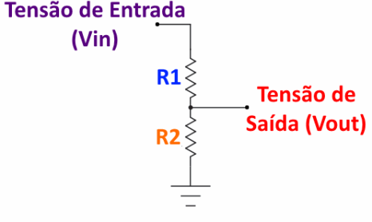

 Fonte: Arduino e cia 

### Divisor de tensão realizado 
 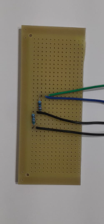

 
## Desenvolvimento do Aplicativo 

Para o desenvolvimento do aplicativo se utilizou o  Blynk , uma plataforma  de Iot para projetar aplicativos para controlar  e monitorar de forma remota.Para viabilizar o controle dos componentes do projeto por meio do celular, foi necessário integrar os códigos ao Blynk, permitindo o acesso via Wi-Fi. Para alcançar essa integração, a ESP8266 passou por testes isolados para verificar sua conexão com a rede utilizada. 

Após confirmar que a conexão com a rede local estava estabelecida corretamente, se procedeu à configuração do código. Isso se tornou necessário, pois os componentes estavam inicialmente programados para iniciar assim que eram ligados, o que não era desejado. Cada componente teve seu código ajustado para atender às especificações desejadas. O código do servo motor, por exemplo, foi modificado para acionar o motor apenas quando um botão específico era pressionado. Da mesma forma, o código do sensor ultrassônico e da célula de carga foi adaptado para garantir que esses componentes entrassem em operação somente após o acionamento do botão correspondente. Isso foi necessario para que não  houvesse funcionamento contínuo dos componentes, reduzindo a possibilidade de falhas. 

A programação dos componentes foi realizada por meio da inserção de widgets no aplicativo, sendo que cada widget possui um identificador único que corresponde precisamente ao que foi programado. Essa abordagem contribuiu para a integração eficiente entre o aplicativo e os componentes do projeto, garantindo um controle preciso.

 ### Código para o aplicativo:

  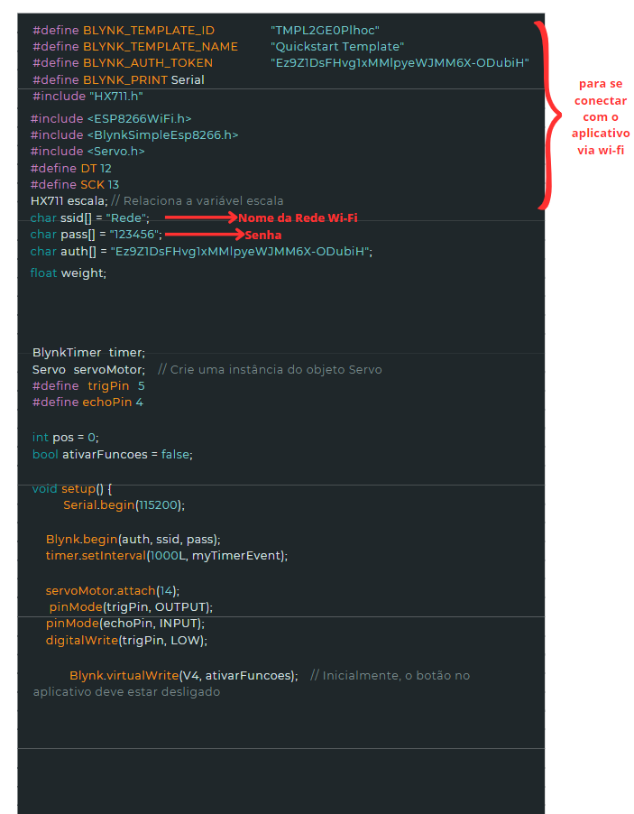
  
  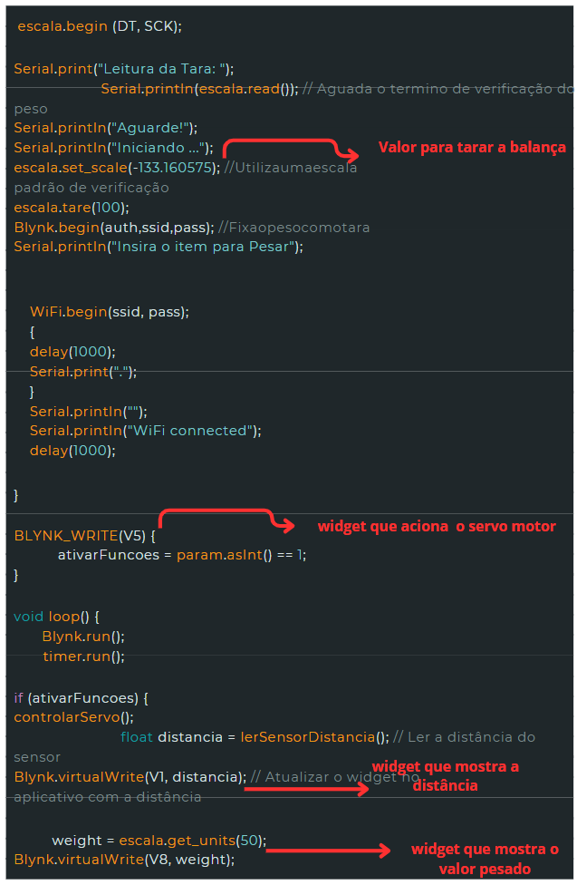
  
  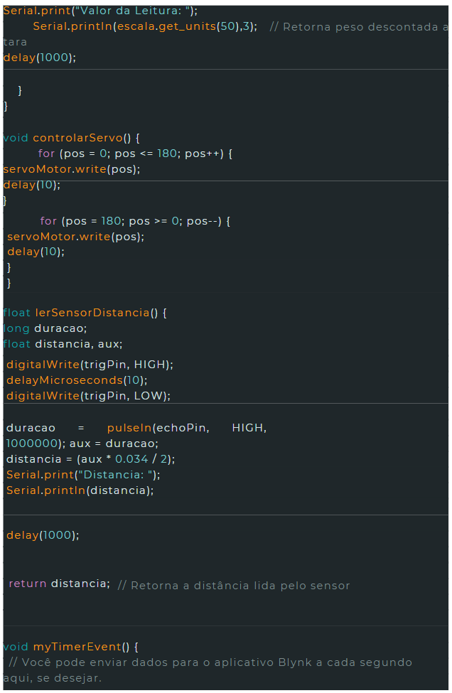

 ## Funcionamento do Aplicativo:

O funcionamento do aplicativo segue a descrição detalhada em outras partes do projeto. Ao acionar o botão, o servo motor realizará um movimento, resultando na liberação do alimento. Após esse movimento, o sensor ultrassônico transmitirá informações sobre a quantidade de alimento restante, com base na distância entre o sensor e o alimento. A distância máxima registrada é de 14,6 cm, indicando uma disponibilidade limitada de alimento. Quanto menor a distância, maior é a quantidade de alimento disponível.

A célula de carga enviará ao aplicativo o peso exato do alimento dispensado. Este aplicativo é versátil, operando em conexões de internet variadas, como redes Wi-Fi convencionais ou dados móveis do celular. Além disso, o Blynk oferece a opção de controle através de um site, proporcionando flexibilidade adicional. A interface do aplicativo é customizável, permitindo ajustes tanto na cor quanto nos ícones

### Interface do Aplicativo no celular 
 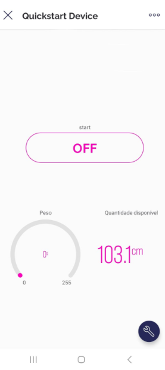

O valor que aparece na distância é o valor da última medição feita, que na foto é um valor de teste feito para testar o aplicativo. 
 ### Interface do site

  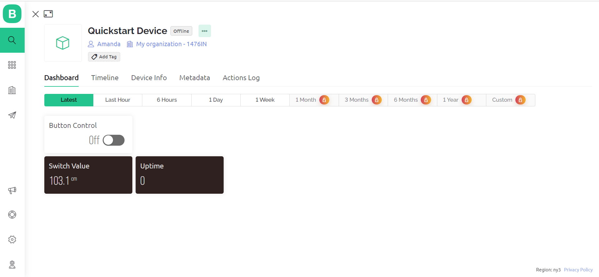

## Montagem

A montagem do projeto foi realizada após a conclusão da impressão 3D de todas as peças. Durante a elaboração do código para a célula de carga, observou-se a necessidade de modificar o suporte onde o prato ficaria fixado. Isso ocorreu devido à exigência de que a célula de carga precisava estar suspensa para permitir a deformação necessária. No modelo anterior, o prato estava fixo no chão, comprometendo o funcionamento adequado da balança. Para resolver esse problema, foi necessário redesenhar o prato, garantindo assim o correto desempenho do projeto.

### Forma de funcionamento da célula de carga
 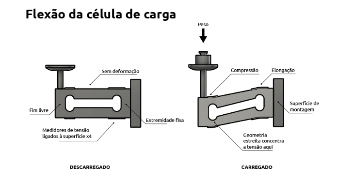
 Fonte: Flintec

A montagem da célula de carga com os pratos foram feitas com parafusos e super cola, isso porque os furos realizados não estavam dimensionados de forma correta, então só foi possível encaixar os parafusos da parte de baixo. Devido a isso, optou-se por fazer o prato superior manualmente, já que os parafusos não iam conseguir se encaixar. O prato foi feito utilizando papelão ondulado, que é um tipo de papelão que possui uma resistência maior, para tentar deixar visualmente melhor, revestiu-se o papelão com papel na cor azul e nas laterais foi utilizado uma fita de decoração. 
### Célula de carga com os pratos 
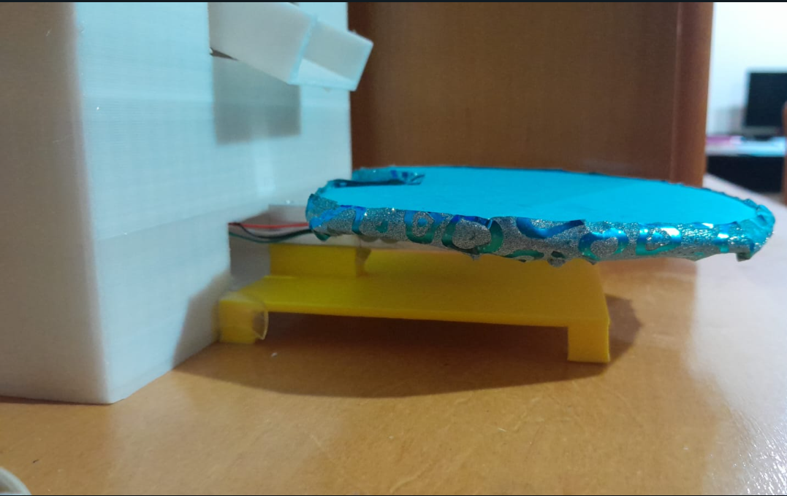

Para a parte da seção rotativa se utilizou uma broca quebrada de 2mm para fazer a fixação do servo motor com a parte que iria liberar a comida, a fixação do outro lado foi realizada com um parafuso pois a broca não atravessa.

### Montagem do servo motor com a seção rotativa
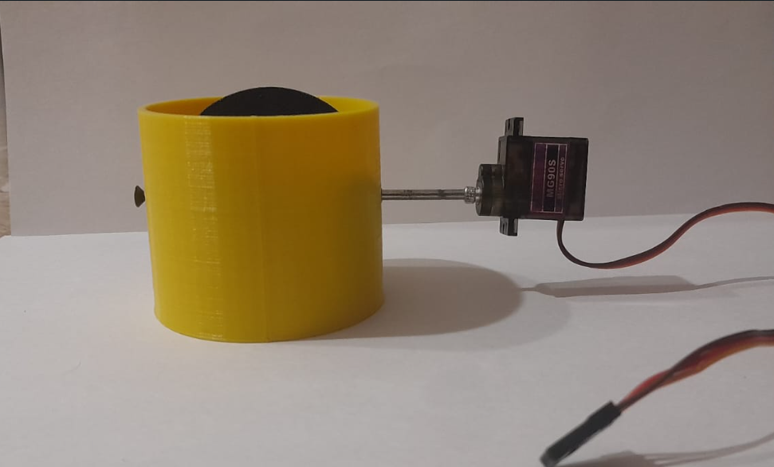

### Montagem do servo motor com a seção rotativa- vista de cima
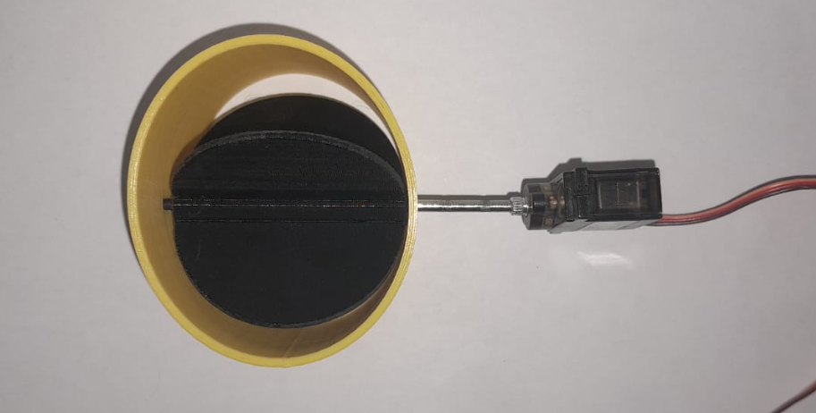

A integração das peças foi realizada utilizando parafusos adequados, super cola, dobradiças e em algumas partes foi necessário a utilização de fita dupla face acrilica, apenas para uma segurança maior em partes que foram utilizados super cola 

O corpo do projeto foi impresso utilizando polimero PLA, ele teve que ser divido em tres partes para que pudesse ser impresso devido ao seu tamanho. 

### Base do projeto 
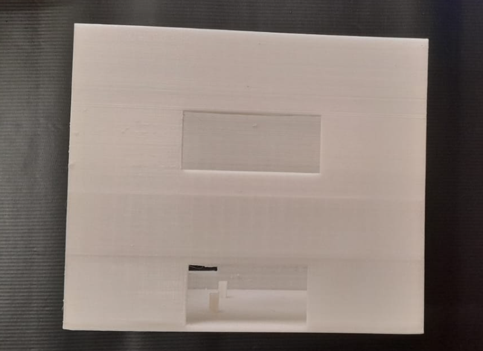
### Base superior 
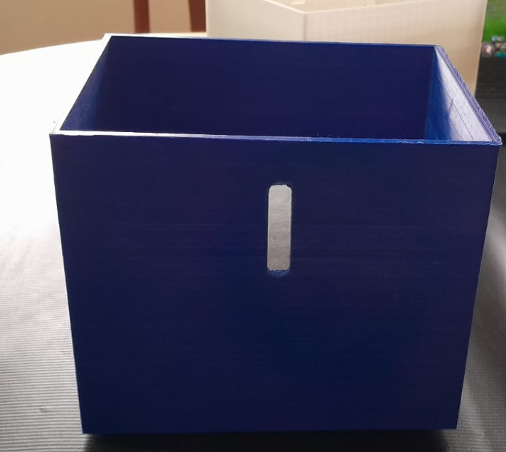

Após possuir todas as peças, integrou-se o funil com a seção rotativa utilizando super cola

### Base com o funil 
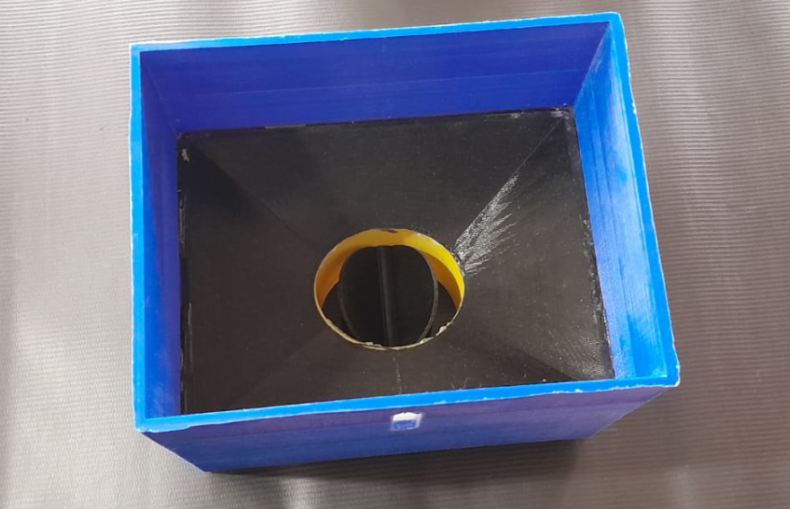

A conclusão da integração de todas as peças, incluindo os componentes eletrônicos, foi efetuada. No entanto, a documentação enfrentou desafios, uma vez que o projeto foi concebido em formato de caixa. Dessa maneira, durante o processo de integração, cada componente exigia a sobreposição de uma caixa sobre a outra. Tal procedimento inviabilizou o registro da disposição final de cada componente. 

Um problema  enfrentado foi a falta de reavaliação das dimensões do projeto após a inclusão de um prato inferior na balança. Isso resultou em uma altura excessiva para o recipiente no qual a comida seria depositada. Consequentemente, foi essencial realizar adaptações no recipiente para assegurar o recebimento da comida sem problemas. Com isso o projeto final ficou desta forma:

### Projeto Final 
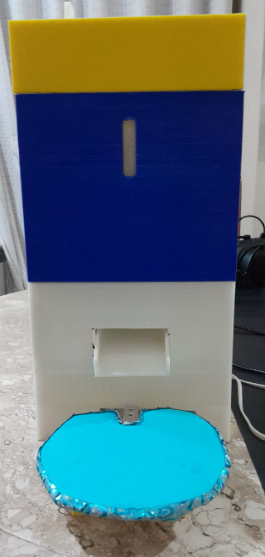

Seu funcionamento pode ser visto acessando o link do youtube: 
[Video de Funcionamento](https://youtu.be/QyngP5Rgk10) 

Não foi possivel ver a interfase do aplicativo logo apos o alimento ser dispensado,  pois como estava fazendo sozinha tive  dificuladade na gravação, isso porque  os dados possuem um  pequeno delay na hora de aparecer no aplicativo. Entretanto  a interfase logo após o funcionamento foi esta, aumentando a distancia e o peso, pois o alimento foi dispensado. 

### Interfase do aplicativo 

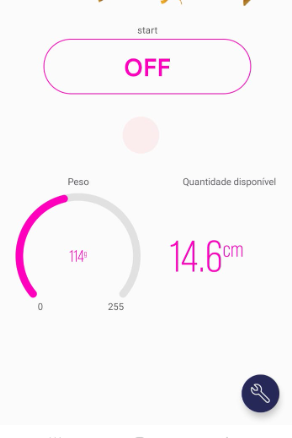 

Desta forma,  se conclui o projeto Alimentador Inteligente para gatos e cachorros da disciplina de Projeto Integrador II. O produto atendeu de maneira eficiente a todos os requisitos pré definidos nas etapas anteriores, permitindo a entrega de um projeto que satisfez integralmente as necessidades estabelecidas
 ## Referências 

 Arduino e Cia. Calculadora Online – Divisor de tensão com resistores. 
 Disponivel em: <https://www.arduinoecia.com.br/calculador-divisor-de-tensao-function/>. Acesso em: 14/11/23

  Flintec. O Que É Uma Célula De Carga E Como Funciona? 
  Disponivel em: <https://www.flintec.com/br/sensores-de-peso/celulas-de-carga/como-funciona-uma-c%C3%A9lula-de-carga>
  Acesso em: 14/11/23

