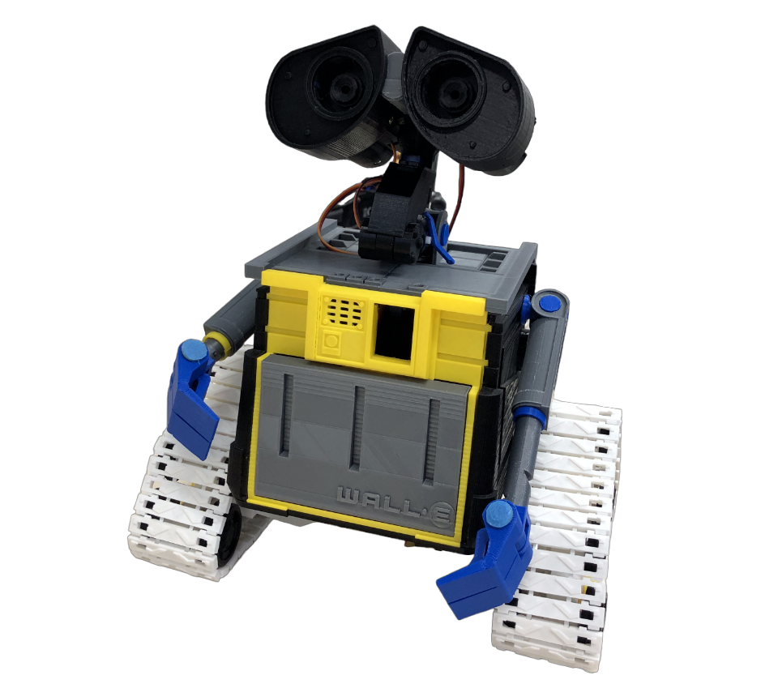
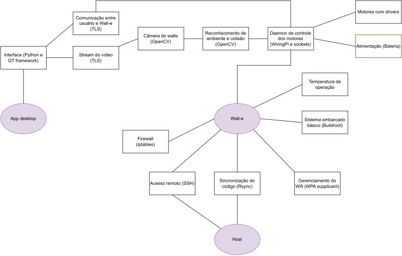

# Concepção

## _Lixeira Móvel com Wall-e_

A internet das coisas (IOT) se refere à conexão e integração de equipamentos, aparelhos e tecnologias a internet, permitindo a comunicação e o gerenciamento deles. Com uma grande atenção voltada para esse setor, a IOT vem ganhando lugar em diversas áreas, incluindo a sustentabilidade. Há projetos relacionados ao gerenciamento inteligente de energia, monitoramento de quantidade de lixo, consumo controlado de recursos (água, por exemplo), entre outros.

Retornando à ideia de conectar aparelhos à internet e torná-los gerenciáveis, esse projeto visa algo semelhante, e com foco na sustentabilidade. O tema do projeto está relacionado com a disponibilização de uma lixeira para as pessoas descartarem lixo.

No LPAE (Laboratório de Pesquisa Avançada em Eletrônica) do IFSC (Instituto Federal de Santa Catarina) campus Florianópolis, há uma carcaça de robô Wall-e (do filme "Wall-e"). Ela foi impressa em uma impressora 3D (a base de plástico), como visto na figura abaixo. Já possuía os motores instalados (8 no total), mas não possui nenhum circuito de alimentação ou que permita sua operação. Esse projeto está relacionado com esse robô.

Assim, a intenção desse projeto é conceber, desenvolver, implementar e operar um robô Wall-e autônomo e no modo teleoperado. Ele deve ser gerenciável remotamente, permitindo selecionar os modos de operação por meio de uma interface gráfica (aplicativo em Desktop).

No modo teleoperado, ele deve receber comandos do computador por meio da interface Wireless. Será desenvolvida uma interface gráfica para o usuário controlar a direção e velocidade do Wall-e, além de receber o vídeo que o robô está captando com sua câmera. Ela também deve conseguir desligar o Wall-e quando necessário.

No modo autônomo, ele deve ser capaz de se mover por conta própria, evitando colisões por meio de técnicas de computação visual. Por exemplo, ao checar uma possibilidade de colisão, ele deve girar em torno do seu próprio eixo até que esteja em uma direção na qual possa se mover, e seguir seu trajeto.

A detecção de colisão pode ser feita por meio da segmentação de imagem recebida por uma câmera. Segmentação é o processo em que uma imagem é dividida em diferentes regiões de interesse. Com isso, é possível identificar o que faz parte do chão e o que pode ser considerado um objeto colidível. Essa câmera será colocada na região frontal do robô.

O objetivo principal do produto é recolher lixo a partir de uma solicitação. O Wall-e deve se mover pelo ambiente, evitando colisões e procurando por lixo. Ao encontrar, deve ir até o lixo, parar na sua frente e notificar as pessoas ao redor da existência desse lixo. A notificação será feita por meio de um sinal auditivo (buzzer). O lixo deve ser coletado por alguém e posto em uma lixeira.

O Wall-e possuirá uma lixeira acoplada (de preferência na parte de trás para evitar que ela atrapalhe os demais mecanismos do robô), atuando como uma lixeira móvel automatizada. Com isso, retorna a ideia inicial da IOT (Internet Of Things): conectar coisas (uma lixeira, nesse caso) à internet e torná-las gerenciáveis.

### Objetivos:

- Interface com o usuário que permita:
	- Operar o Wall-e de forma teleoperada (comunicação wifi)
		- Controlar a direção do Wall-e
		- Controlar a velocidade do Wall-e
	- Streaming de vídeo do Wall-e (por meio de wifi)
	- Alterar entre o modo autônomo e o teleoperado
	- Desligar o Wall-e remotamente (executar a operação de "halt")
- Controle dos motores
- Tornar o Wall-e autônomo, evitando colisões ao se mover

#### Ideias de objetivos extras, caso sobre tempo para implementar:

- Identificar lixo
- Recolher lixo (precisa da instrução de alguém da área de mecânica ou um bom material de base)

### Lista dos principais materiais e ferramentas do projeto:

- Carcaça do Wall-e impressa em 3D
- Raspberry Pi 3B+
- 8 Motores (2 de corrente contínua e 6 de passo)
- Drivers de motores
- Computador (para gerenciar o Wall-e)
- Módulo de câmera do Raspberry PI (talvez uma câmera USB funcione)

### Diagrama de blocos para implementação do projeto

Foi elaborado, considerando os objetivos, um diagrama funcional inicial do projeto. Veja na figura abaixo. O Host seria a máquina utilizada para programar e fazer manutenção no Wall-e, não obrigatoriamente o usuário (pessoa que está gerenciando o robô).

A interface gráfica do usuário será escrita em Python (linguagem interpretada de alto nível) usando o framework gráfico QT, o qual é uma ferramenta simples e bem documentado usada para criar interfaces gráficas.

A comunicação entre o usuário e o Wall-e pode ser feita usando a API de Streams do Python. Ela é uma API de alto nível para acessar a internet e possui suporte ao Wrapper TLS/SSL do Python. Com ele, é possível autenticar e encriptar a comunicação do usuário com o Wall-e.

Além disso, é necessário embarcar um sistema operacional Linux na Raspberry Pi. Planeja-se gerar um usando o Buildroot, ferramenta que simplifica a geração de imagens Linux para sistemas embarcados. Caso a complexidade se torne muito elevada, é possível usar uma das imagens disponibilizadas no próprio site da Raspberry Pi. No caso de usar o Buildroot, as configurações do sistema operacional serão feitas por meio de ferramentas em linha de comando. Por exemplo: Wpa supplicant ou NetworkManager são serviços de gerenciamento de conexão de rede que podem ser usados para configurar o Wifi; e Iptabels ou Nftables são ferramentas usadas para configurar o firewall.

Para acessar remotamente o Wall-e, será iniciado um servidor SSH (protocolo para realizar login remoto de forma segura) no robô e, para facilitar a sincronização de arquivos e código, será usado a ferramenta de sincronização de arquivos "Rsync".

O código principal do Wall-e será escrito em Python. Ele deve ser responsável pela movimentação, receber os comandos do usuário e identificar colisões. A visualização e segmentação da imagem da câmera pode ser feita em várias ferramentas de computação visual e machine learning como: OpenCV, SimpleCV, TensorFlow ou Pytorch. Inicialmente, tentaremos implementar com o OpenCV.

A posição (ângulo) dos motores de passo são definidos pela largura de pulso do PWM usado para controlá-los. Isso exige um controle fino das saídas GPIO da Raspberry. O código em Python pode não conseguir ajustar a largura de pulso corretamente. Se isso ocorrer, podemos escrever um Daemon em C++ para controlar os motores e fazer o código principal em Python se comunicar com ele por meio de sockets (API para envio de pacotes pela rede). Para controlar os pinos GPIO da Raspberry Pi, existem as bibliotecas RPi.GPIO (Python) e WiringPi (linguagem C).

Além disso, algumas preocupações que devemos ter seria a verificação e validação dos motores, baterias e drivers. Também é necessário checar a questão térmica. Por exemplo, se a Raspberry não sobreaquecerá dentro do robô, sendo necessário implementar alguma forma de ventilação forçada.

---
Topo: [equipe_LuLu](../README.md)
