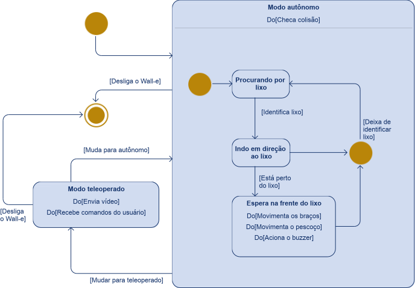
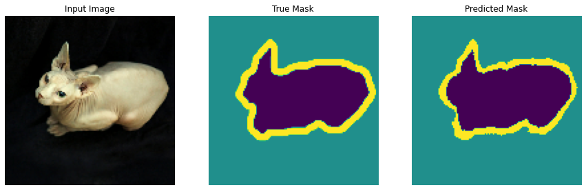
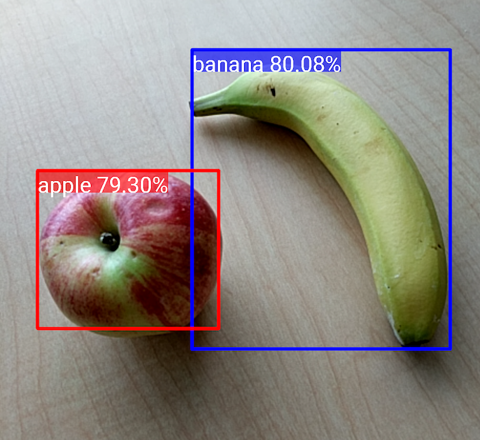
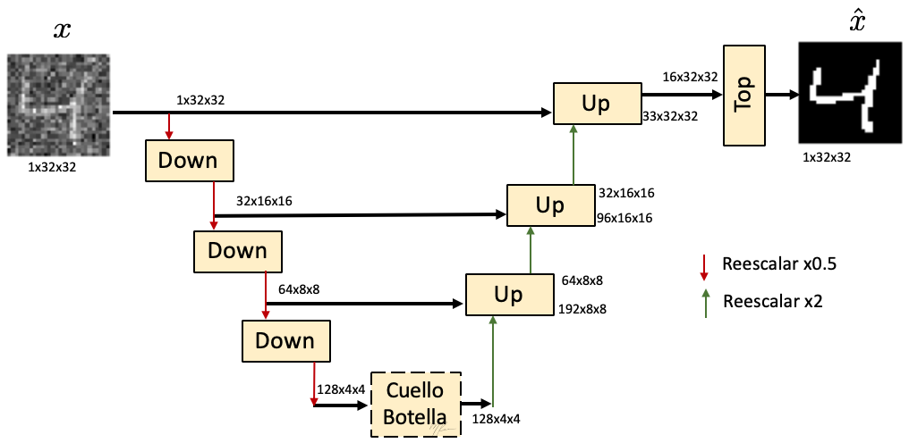
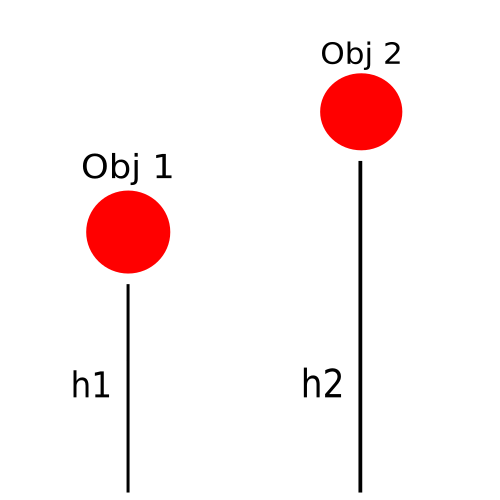
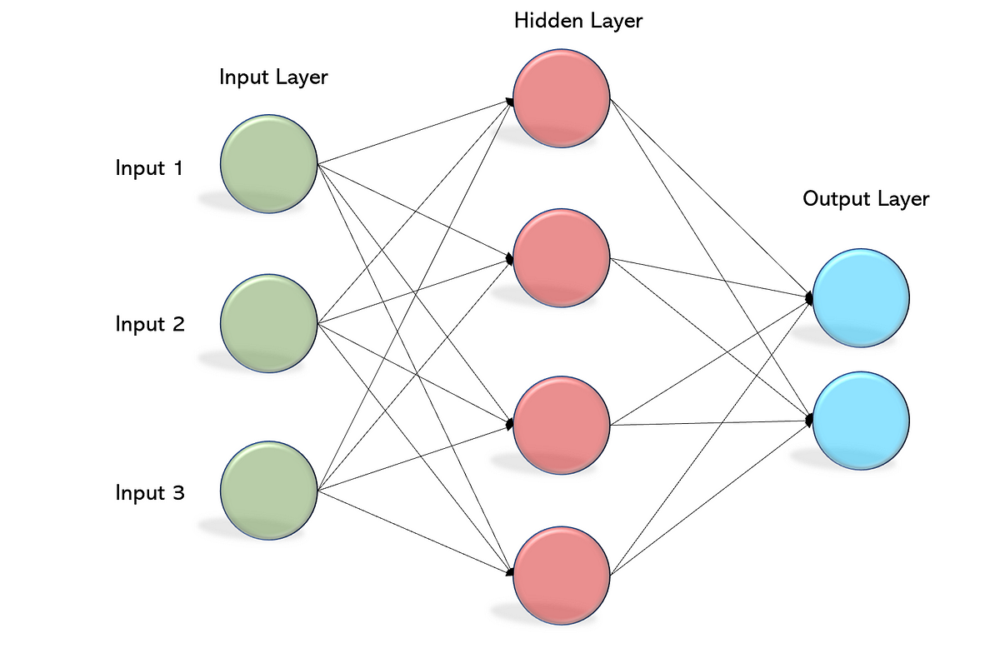
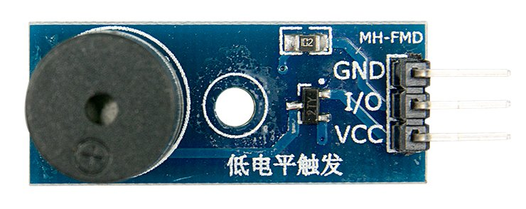

# Movimentação do Wall-e no modo autônomo

Quando o Wall-e estiver no modo autônomo, ele deve se mover por conta própria em um ambiente fechado, evitando colisões e procurando por objetos que considere como lixo. Para isso, ele usará imagens recebidas de uma Webcam posicionada de forma o observar a sua frente. Ao identificar visualmente um lixo, deve ir até ele e esperar na frente do lixo até que alguém recolha e jogue na lixeira. Enquanto estiver parado, notifica a existência de lixo mexendo os braços e pescoço, e por meio de um sinal auditivo (buzzer).

A checagem de colisão deve ocorrer enquanto o Wall-e estiver no modo autônomo, independentemente de ter identificado lixo ou não.

Abaixo está o diagrama representando os estados de operação do Wall-e.

A checagem de colisão será feita visualmente. Ou seja, o Wall-e deve possuir uma câmera (Webcam) para captar as imagens a sua frente e processar essas imagens para saber o que é colidível ou não. Para isso, será utilizado o processo de segmentação semântica de imagens. Este consiste, basicamente, em gerar um máscara correspondente a um objeto em uma imagem. Dessa forma, atribui, a cada píxel da imagem, um significado. Um exemplo de máscara gerada por meio de segmentação pode ser observado na imagem abaixo. A imagem original está a esquerda, a máscara correspondente a imagem no centro, e a máscara gerada por segmentação está a direita.

Fonte: [Tensorflow - Segmentação de Imagem](https://www.tensorflow.org/tutorials/images/segmentation)

Com a segmentação é possível gerar uma máscara que defina todos os objetos colidíveis e que o Wall-e deve desviar, separando-os do chão pelo qual o Wall-e pode passar tranquilamente. A segmentação será feita por meio de um modelo de machine learning, como será apresentado posteriormente.

Para identificar o que é lixo, será usado um algoritmo de identificação de objetos que fornece a posição em que o lixo está na imagem capturada pela câmera. Esses algorítimos recebem uma imagem (captura de vídeo, por exemplo) e retornam uma lista de regiões da imagem com os objetos detectados.

Por exemplo, se um desses algoritmos fosse usado para identificar frutas, e a lista de objetos reconhecidos fosse usada para marcar as regiões correspondentes deles, o resultado seria o seguinte:

Fonte: [Tensorflow - Detecção de objetos](https://www.tensorflow.org/lite/examples/object_detection/overview)

Como o Wall-e pode esperar na frente de apenas um lixo até que ele seja recolhido, não serão usados todos os objetos detectados. Apenas o mais próximo do Wall-e.

Tanto a máscara quanto a informação de onde está o lixo mais próximo serão aplicados a um algorítimo controlador (mencionado posteriormente na documentação) que determinará qual a melhor direção que o Wall-e deve seguir para procurar pelo lixo, ou alcançá-lo.

## Código do gerenciamento do Wall-e

O código dessa etapa será escrito em Python. A captura da câmera da Webcam será feita usando a biblioteca OpenCV. Os modelos de machine learning necessários serão construídos usando a biblioteca do Tensorflow para Python. A execução dos modelos serão feitas por meio do OpenCV na própria Raspberry Pi.

O OpenCV não consegue executar todos os modelos do gerados pelo Tensorflow. Nesse caso, o código será executado na Raspberry Pi usando o Tensorflow Lite, a versão do Terforflow desenvolvida para aparelhos mobile e microcontroladores. Essa versão possui melhor desempenho em CPU do que o Tensorflow padrão. Será melhor para a Raspberry Pi já que não é possível usar sua GPU para executar os modelos do Tensorflow.

## Modo de operação do Wall-e

Devido ao funcionamento, é possível separar o modo de operação autônomo do Wall-e em dois momentos:

1) Operação antes de identificar lixo
2) Operação ao identificar lixo

### Operação antes de identificar lixo

O Wall-e deve se mover pelo ambiente procurando por lixo. A operação nessa condição pode ser dividida nas seguintes etapas:

1) Captura a imagem da Webcam
1) Segmenta a imagem recebida da câmera usando o modelo de segmentação de imagem criado com o Tensorflow
2) Aplica a máscara como entrada no controlador
3) Direciona os Wall-e com a direção fornecida pelo controlador

#### Modelo de segmentação

O modelo de segmentação de imagem utilizado será um U-Net customizado com o MobileNetV2 como codificador. U-Net é um modelo de segmentação de imagem desenvolvido para segmentação de imagens biomédicas (identificação de tumores, por exemplo). Esse modelo possui uma estrutura dividida em 'codificador' e 'decodificador'. O codificador possui a função de diminuir a resolução enquanto captura informações da imagem. Já o decodificador faz o oposto: usa as informações interpretadas pelo codificador para aumentar a resolução da imagem. Na saída do decodificador, está a máscara gerada pelo modelo. O modelo do U-Net original está ilustrado na imagem abaixo.

Fonte: [La UNet](http://personal.cimat.mx:8181/~mrivera/cursos/aprendizaje_profundo/unet/unet_segmentacion.html)

Mais informações sobre o U-Net estão disponíveis no ['tutorial do Pyimagesearch sobre o U-Net'](https://pyimagesearch.com/2022/02/21/u-net-image-segmentation-in-keras/).

Nesse projeto, ao invés do codificador padrão do U-Net, será usado o MobileNetV2. Ele, na verdade, é um algorítimo de classificação de imagem, mas é possível usá-lo como decodificador, como mostrado no ['Tutorial do Tensorflow sobre segmentação de imagem'](https://www.tensorflow.org/tutorials/images/segmentation). Sua vantagem é a velocidade, já que foi desenvolvido para ser executado em dispositivos Mobile. Existe uma implementação pronta desse modelo no Tensorflow.

O modelo desse projeto foi baseado no ['tutorial do Tensorflow sobre segmentação de imagem'](https://www.tensorflow.org/tutorials/images/segmentation). Ele possui um desempenho significativo rodando em CPU: em torno de 30ms para segmentar uma imagem de 128px por 128px em um computador moderno, um único thread.

Há um script de ['teste do modelo'](test_tf/test.py) na pasta ['test_tf/'](test_tf/) que realiza algumas iterações do modelo de teste dessa arquitetura e mostra o tempo necessário para realizar a segmentação de uma imagem. Esse script não segmenta a imagem em si, apenas mostra o tempo necessário para tal. O código usado para gerá-lo está disponível no site já mencionado: ['tutorial do Tensorflow sobre segmentação de imagem'](https://www.tensorflow.org/tutorials/images/segmentation).

#### Treinamento do modelo

Para treinar modelos de segmentação de imagem, é necessário um dataset (base de dados) com as imagens usadas no treinamento e suas respectivas máscaras que o modelo deve criar. Quanto maior o dataset, mas bem treinado o modelo será. Conseguir uma boa base de dados com essas características e muitas imagens é uma tarefa difícil, até porque normalmente suas máscaras devem ser feitas a mão.

Uma alternativa a uma base de dados feitas de imagens reais é o uso de computação gráfica para gerar as imagens e máscaras dos datasets. Essa etapa pode ser feita usando o Blender (software de modelagem, animação, renderização 3D e mais). Nele, é possível construir um ambiente 3D e exportar um vídeo do ambiente, e um vídeo composto pelas máscaras do vídeo original. Esses vídeos então são processados e usados para gerar o dataset para o treinamento do modelo.

### Operação ao identificar o lixo

Será usado um modelo de identificação de imagens próprio do OpenCV. Por meio de Haar Cascades ou LBP.

Será utilizado o OpenCV (Open Source Computer Vision) o qual é uma biblioteca de programação, de código aberto, sendo usada para diversos tipos de análise em imagens e vídeos, reconhecimento facial, entre outros. O openCV tem uma ferramenta para detecção de objetos. Para tal, será usado o Haar Cascades, que seleciona um pequeno número de características visuais críticas de uma determinada imagem e as utiliza para detecção e classificação de objetos. O código que será desenvolvido será feito com a linguagem de programação Python.

Os modelos de Haar Cascades serão treinados por meio do próprio OpenCV, que disponibiliza aplicações para tal. As instruções de criação de modelos estão documentadas na página do OpenCV ['Cascade Classifier Training'](https://docs.opencv.org/3.4/dc/d88/tutorial_traincascade.html).

Ao fornecer um frame da captura da câmera, ele retornará os objetos identificados, suas posições no frame e outras informações relevantes. Com isso, é possível identificar onde o lixo mais próximo está e enviar essa informação para o controlador, que definirá o melhor caminho para o Wall-e até alcançar o lixo.

O lixo mais próximo é aquele que estiver mais próximo da margem inferior da imagem. Por exemplo, na imagem abaixo, o objeto Obj1 está mais próximo do Wall-e do que o objeto Obj2, pois h1 é menor do que h2.

Fonte: autoria própria

## Controlador

O controlador é responsável por definir a direção e velocidade de movimento do Wall-e, e seu comportamento quanto a identificação do lixo.

Para definir a direção, usará um algorítimo de rede neural para saber a direção que o Wall-e deve prosseguir: O MLP (Multilayer perceptron).

Esse algorítimo consiste em uma rede neural simples com pelo menos três camadas, como ilustrado na imagem a seguir:

Fonte: [Multi layer Perceptron (MLP) Models on Real World Banking Data](https://becominghuman.ai/multi-layer-perceptron-mlp-models-on-real-world-banking-data-f6dd3d7e998f)

O primeiro layer (da esquerda) é a entrada do modelo, e o da direita é a saída. Os demais layers são chamados de layers ocultos (hidden). Os círculos da imagem são os nós, responsáveis por atuar de forma semelhante a um neurônio artificial. Cada neurônio de um layer está conectado a todos layers das camadas anteriores. Cada conexão possui um peso e um limite associados. As informações de entrada passam por esses nós, sendo processada pelo caminho, até chegar em um resultado. A forma como esses neurônios atuam são muito extensas de descrever nessa documentação; portanto, para mais informações, acesse o artigo da fonte da imagem anterior e a série de vídeos do canal do Youtube 3Blue1Brown sobre ['redes neurais'](https://www.3blue1brown.com/topics/neural-networks). Este último explica de forma visual o funcionamento das redes neurais.

O modelo MLP desse projeto receberá a máscara gerada no processo de segmentação, e a localização do lixo mais próximo. A saída do modelo será um número de 0 a 1 que indica a direção para onde o Wall-e deve se mover. 0 significa que deve se deslocar o máximo possível a direita (sentido horário visto de cima) e 1 significa que deve se deslocar o máximo possível a esquerda (sentido anti-horário visto de cima). Dessa forma o controlador sabe para qual direção o Wall-e deve seguir.

O MLP será treinado para direcionar o Wall-e pelo ambiente enquanto não estiver seguindo algum lixo, e direcionar o Wall-e para o lixo quando ter identificado algum. Em qualquer das opções, deve evitar possíveis colisões.

Quanto a velocidade, ela será fixa quando estiver se movendo pelo ambiente. O controlador apenas cancelará o movimento do Wall-e quando estiver na frente de um lixo, ou quando haver algum objeto colidível na frente do Wall-e.

Ao alcançar um lixo, o Wall-e deve esperar na frente dele até que seja removido. Sua lixeira está disponível para o descarte de lixo. Para implementar isto, basta que o Wall-e não se mova enquanto identificar algum lixo na sua frente. Quando não conseguir mais identificar o lixo, o Wall-e considera que ele foi recolhido, assim, podendo prosseguir com seu caminho (continuar a procurar por mais lixo).

No caso de existir um objeto colidível na frente do Wall-e, o controlador o rotacionará em torno do seu eixo até encontrar uma direção sem objetos colidíveis para que o robô possa prosseguir a procurar por lixo.

O controlador será implementado na linguagem Python. O MLP será desenvolvido com o Tensorflow.

### Buzzer

O buzzer usado é o modelo MH-FMD. Possui alimentação de 3.3V a 5V. É do tipo ativo (basta alimentar que emite som).

Fonte: [GRAVITECH - ACTIVE DC BUZZER MODULE - MH-FMD](https://www.gravitechthai.com/product-detail.php?WP=pQSgAKp5GQSgG2rDqYyc4Uuw)

Não é necessário elevar o nível lógico do GPIO da Raspberry Pi para 5V, já que ele pode operar em 3,3V. Basta conectar a alimentação do buzzer na saída 3,3V e o pino I/O em um dos GPIO da Raspberry Pi.

---
Anterior: [Movimentação do Wall-e no modo teleoperado](movimentacao.md) | Topo: [Desenvolvimento](README.md) | Próximo: [Administração do Wall-e](manutencao.md)
