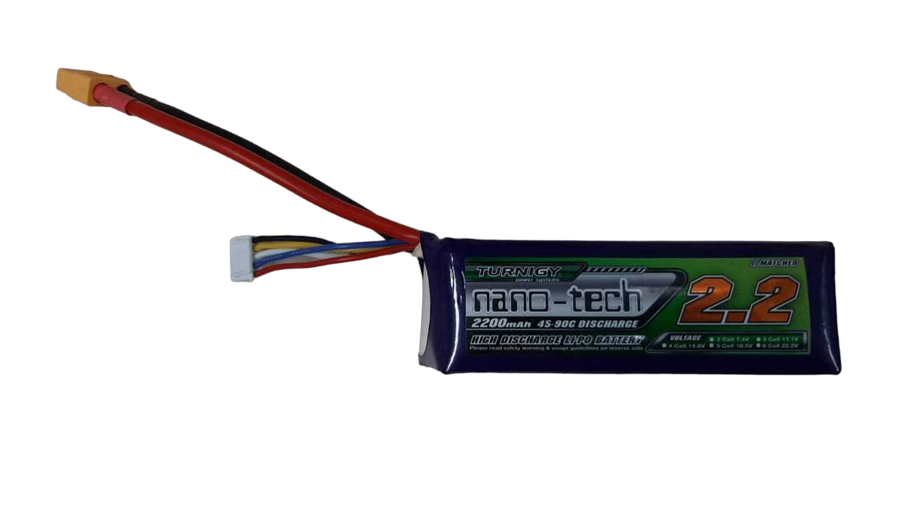
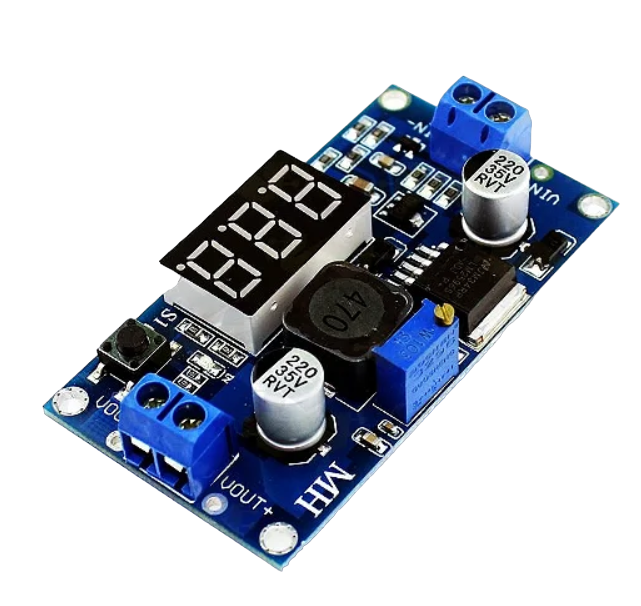
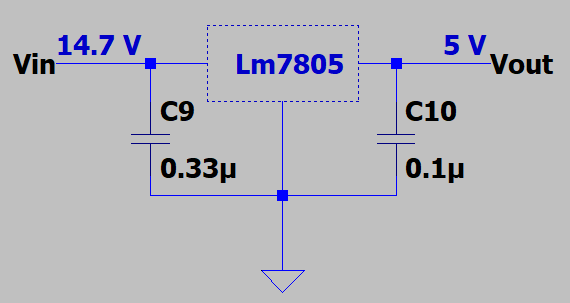

# Baterias 

A bateria de qualquer projeto, é uma das principais partes no quesito dimensionamento correto para o bom funcionamento do projeto. Os testes e considerações estudadas anteriormente que serão feitos, são de extrema importância quando estamos interessados em grande autonomia e segurança.

Fonte: Autoria Própria

|         Especificações         |         Corrente nominal          |
|             ------             |              ------               |
|         Marca e modelo         | Bateria Turnigy Nano-tech Lipo 4s |
|             Tensão             |              14.8 V               |
|           Capacidade           |             2200 mAh              |
|    Taxa de descarga máxima     | 45 C (constante) - 90 C (máximo)  |
|           Dimensões            |            115x35x27mm            |
|        Tipo de bateria         |               LIPO                |
| Temperatura máxima de operação |              0-35 ℃               |

### Dimensionamento das Baterias

O dimensionamento das baterias consideram os estudos e validações feitos anteriormente, entre elas:

- Computador Raspberry PI 1 (gerenciamento e processamento de informações)
- Análise em Bancada dos Motores
- Análise dos Componentes usados para o Acionamento do Circuito de Carga do Wall-e

Neste momento, o estudo sobre a bateria e seu respectivo esquemático elétrico foi dividido nas seguintes etapas:

- Identificar consumo do circuito (motores, controladores, conversores, etc)
- Controle automático de acionamento da bateria
- Análise e controle dos níveis de tensão e corrente
- Regulador de tensão

### Consumo do Circuito

O consumo do circuito está quase que inteiramente ligado aos motores e a Raspberry Pi 1, portanto para entender quanto de consumo de corrente o Wall-e terá, ou o quanto de potência a bateria deve prover ao circuito de funcionamento, deve-se entender o consumo dos componentes e especificamente os que mais consomem.

|    Motores     | Corrente nominal | Corrente Máxima |
|     ------     |      ------      |     ------      |
|    Motor DC    |      180 mA      |     580 mA      |
|  Servo Motor   |      300 mA      |     1,85 A      |
| RaspBerry PI 1 |                  |     200 mA      |

### Controle de Acionamento da Bateria

O Wall-e contará com um botão de acionamento do circuito da bateria, ou seja, ao plugar a bateria no Wall-e ele não ligará instantaneamente, apenas após o acionamento do botão para segurança.

### Controle dos Níveis de Tensão e Corrente

Para o circuito elétrico, a análise das tensões das células e a corrente consumida é de suma importância para segurança do dispositivo. Assim sendo foi incrementado ao circuito da bateria os seguintes componentes:

 - BMS 4s (battery management system)
 - Regulador de Tensão Buck e LM784
 - Regulador de Corrente LM317

### Reguladores de Tensão para Motores

Para os servos motores, será necessário a utilização de reguladores de tensão, quando que, para os mesmos não é possível operá-los com a tensão diretamente provida pela bateria. Por conta deste fator foi pensado em utilizar o Conversor DC-DC Step Down Buck.

Assim temos a tensão da bateria de 14,8 V rebaixada para aproximadamente 5 V.

### Reguladores de Tensão para Raspberry Pi

Para a alimentação da Raspberry é de extrema importância manter a tensão de entrada em 5V; portanto, é necessário um componente que mantenha, mesmo com variações da bateria, os 5V necessários para o bom funcionamento da Raspberry, lembrando que, a Raspberry fará todo o processamento de imagem e não pode desligar no meio do processo ou ter problemas de alimentação que resultarão em perde de processamento.

Portanto, faz-se necessário o uso do LM7805 que irá manter a tensão de alimentação da Raspberry Pi em 5V continuos e constantes.

A distribuição do LM7805 e seus componentes auxiliares é vista na imagem a seguir:

O LM7805 é um regulador de tensão capaz de fornecer até de 1,0 A com uma tensão de saída fixa em 5 V.

A necessidade dos capacitores é:
- C9 é necessário se o regulador estiver localizado a uma distância considerável do filtro da fonte de alimentação.
- C10 é necessário para melhorar a estabilidade e a resposta transitória.

---
Anterior: [Raspberry Pi](raspberry-pi.md) | Topo: [Desenvolvimento](README.md) | próximo: [Validação dos motores](validacao-motores.md)
