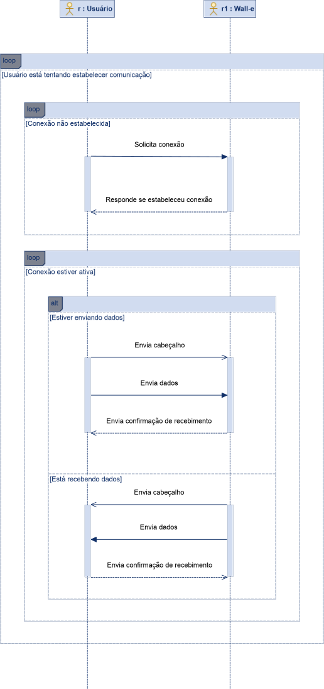
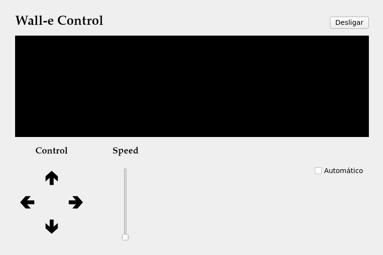

# Comunicação entre o cliente e o Wall-e

A comunicação ocorrerá por meio do Wifi. Ou seja, tanto o cliente quanto o Wall-e deverão estar conectados a internet para poderem se comunicar. O Wall-e atuará como um servidor esperando o usuário se conectar a ele. O usuário estará atuando como um cliente tentando se conectar ao Wall-e. Quem inicia a conexão é o usuário. Apenas um usuário pode se conectar com o Wall-e por vez.

A comunicação será estabelecida por meio do protocolo TLS. Esse é um protocolo desenvolvido para estabelecer uma comunicação privada, autenticada e segura (criptografada) em meio a uma rede em que não se pode garantir a segurança. Chaves e certificados são as principais ferramentas da criptografia assimétrica e se baseiam no fato de que a informação criptografada com a chave pública (contida no certificado) apenas pode ser descriptografada pela chave privada. Esse é o conceito básico por trás da criptografia assimétrica. Essa proteção é necessária para evitar que um terceiro se conecte ao Wall-e ou espione a comunicação do usuário com o Wall-e.

Para estabelecer a comunicação, ambos os lados (usuário e servidor), deverão se autenticar por meio da troca de certificados e chaves criptográficas. Isso significa que o usuário deverá possuir o certificado do Wall-e para garantir que está se conectando ao Wall-e. O mesmo pode ser dito para o Wall-e: ele deverá possuir o certificado do usuário para garantir que apenas o usuário se conecte com ele.

Após estabelecer a comunicação, o usuário e o Wall-e podem trocar pacotes pela rede. A forma como serão enviados seguirá uma ordem para garantir o recebimento das instruções. Sempre que um conjunto de dados for enviado, primeiramente, será enviado um cabeçalho com o número total de bytes do conjunto, e depois os dados serão enviados. Dessa forma, o recebedor tem conhecimento do tamanho total dos dados e sabe quantos bytes deve receber, aguardando por todos eles.

Após isso, o enviador esperará uma mensagem de confirmação do recebedor. Caso não receba, considera que houve falha na comunicação e reinicia a mesma. Esse protocolo será usado tanto pelo Wall-e quanto pelo usuário, e está ilustrado no diagrama de sequência a seguir.

O protocolo é necessário para evitar que um conjunto de dados seja recebido parcialmente. Se o recebedor conhecer o tamanho em bytes dos dados que deve receber, é possível confirmar se algum pacote foi perdido no caminho da comunicação. A mensagem de confirmação é necessária para que o enviador saiba quando pode enviar outro conjunto de dados.

Para o usuário poder se conectar ao Wall-e, é necessário saber qual o IP dele. Para isso, será usado um IPV6 fixo pré-configurado para o Wall-e. Dessa forma, o IP é conhecido pelo cliente e ele pode iniciar a comunicação.

Esse protocolo será utilizado tanto para enviar as instruções do usuário para o Wall-e, quanto enviar o vídeo do Walle-e para o usuário. Se o envio de vídeo se tornar muito custoso para o hardware usado, será removido a criptografia dele e apenas o envio de comandos para o Wall-e será criptografado.

## Interface de usuário

A interface desenvolvida conseguirá enviar os comandos para o Wall-e e receber o stream de vídeo dele para apresentar ao usuário. Os comandos que ela deve enviar são:

1) Controle de movimento (direção e velocidade)
2) Alterar entre modo teleoperado e modo autônomo.
3) Desligar o Wall-e.

A direção de movimento do Wall-e deve ser controlada por meio dos botões 'A', 'S', 'D' e 'W' do teclado, além de do joystick próprio da interface (que pode ser selecionado com o mouse). O controle da velocidade será feito por meio de uma barra vertical. O modo de operação será selecionado por uma checkbox. Além disso, deve haver um botão para desligar o Wall-e. Veja, abaixo o modelo de interface esperado:

Para desenvolver a interface, será utilizado a linguagem de programação Python e o framework QT. O módulo usado para fornecer o framework será o PySide6.

### Instruções enviadas pela interface

A comunicação das instruções será feita por emio do envio de textos (strings).

No caso de comandos de movimentação, serão enviados a velocidade linear e velocidade angular na qual o Wall-e deve se locomover. Os valores de velocidade linear variam de -100 a 100 em que -100 é a velocidade máxima para tráis e 100 é a velocidade máxima para frente. De forma análoga, os valores de velocidade angular variam de -100 a 100 em que -100 é a velocidade máxima para o sentido horário e 100 é a velocidade máxima para o sentido antihorário. As orientações são definidas visualizando o Wall-e de cima.

A velocidade linear será representada por 'v', e a angular por 'w'. Por exemplo, "v:50,w:90" significase mover a 50% da velocidade linear máxima e 90% da velocidade ângular máxima para o sentido anti-horário (visualizando o Wall-e de cima).

Esses valores serão processados pelo Wall-e de forma a definir a velocidade com que cada roda deve se mover. Na verdade, enquanto no modo teleoperado, a interface de usuário deverá continuamente enviar os comandos de direção e velociade do Wall-e para fazê-lo se mover. Se o robô deixar de receber esses comandos, deve para o movimento. Assim, se ocorrer de a conexão com o usuário for interrompida durante o movimento, não corre o risco do Wall-e continuar a se mover de forma desgovernada.

No caso das instruções de desligamento e mudança de modo de operação, serão enviadas as strings conforme a tabela abaixo:

|       Instrução       | String enviada |
|         :---:         |     :---:      |
|       Desligar        |     "halt"     |
| Muda para teleoperado |     "tele"     |
|  Muda para autônomo   |     "auto"     |

## Código da comunicação

O código da comunicação será escrito em Python. Essa linguagem possui primitivas e módulos nativos que facilitam a implementação da comunicação:

* Streams: Primitiva da biblioteca 'asyncio' usada para estabelecer streams de dados por meio de conexões de rede.
* ssl: Wrapper capaz de aplicar o protocolo SSL/TLS na conexão de rede. Pode ser usado na primitiva 'Streams' já mencionada.

Deve-se criar um módulo em Python para implementar a comunicação. Esse módulo pode ser usado tanto para implementar o código do usuário quanto o código do Wall-e.

A captura de frames da câmera (Webcam) será feito com o OpenCV, biblioteca multiplataforma para computação visual. Possui módulo para Python.

## Certificados e chaves criptográficas

Para implementar o protocolo TLS, é necessário o uso de Certificados e chaves criptográficas. Esses componentes são utilizados para garantir a autenticidade dos dois lados da comunicação, além de encriptar o tráfego da comunicação. Portanto, não devem ser possuídas por ninguém além do usuário e do Wall-e.

Os certificados e chaves usados pelo módulo ssl do Python devem estar no formato PEM. Esse é um dos formatos de certificado mais usados e podem ser gerados usando o OpenSSL. Será escrito um script para automatizar a geração desses certificados, contanto que o OpenSSL esteja instalado na máquina. Há diferentes formatos de chaves que podem ser usadas para estabelecer a comunicação. Inicialmente, será utilizado chaves RSA.

---
Topo: [Desenvolvimento](README.md) | Próximo: [Movimentação do Wall-e no modo teleoperado](movimentacao.md)
