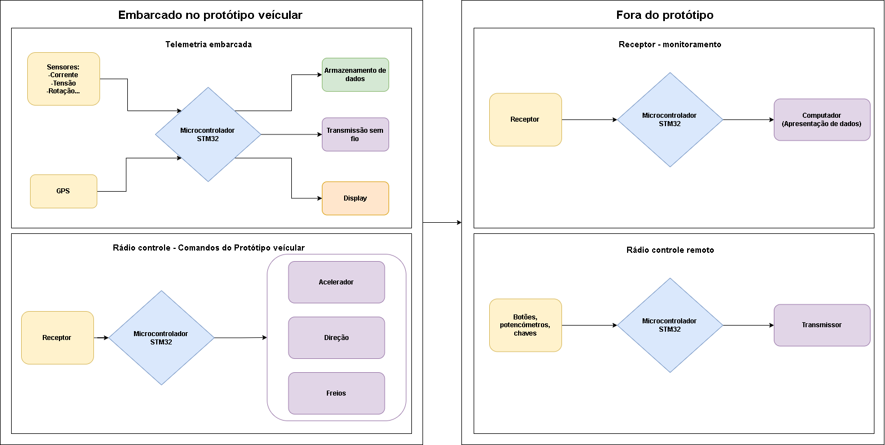

# **CONCEIVE**

## Resumo

Diferentes formas de mobilidade estão se popularizando cada vez mais no cotidiano das pessoas, sendo assim, cada vez mais torna-se importante a elaboração de conceitos e de protótipos. São exemplos os veículos elétricos que por possuírem diversos benefícios em relação aos veículos a combustão tornando-se cada dia mais viáveis para inserção em massa principalmente nas zonas urbanas. Para contribuir no desenvolvimento de veículos várias universidades estão buscando pelo aperfeiçoamento da mobilidade através de protótipos veiculares.

## Motivação

Objetivando o desenvolvimento tecnológico e redução de impactos ambientais causados pela mobilidade existem equipes de competição espalhadas pelo mundo competem buscando aumentar a eficiência de protótipos veiculares. Neste processo testam-se novos conceitos e aperfeiçoa-se o desenvolvimento de sistemas de propulsão, visando principalmente a eficiência energética. Ao elaborar esses protótipos busca-se o máximo de distância percorrida com o mínimo de consumo energético.

## Importância do sensoriamento de protótipos

Visando o aperfeiçoamento dos protótipos torna-se necessária a obtenção, transmissão e armazenamento de informações de sensores que estão envolvidos na dirigibilidade dos protótipos.
Focando em veículos propelidos por eletricidade, as variáveis mais importantes envolvidas são: Tensão instantânea da bateria, corrente instantânea de consumo, velocidade, rotação das rodas, nível de aceleração, temperatura do controlador e motor, tempo gasto e restante, entre outras.

## Sistema de telemetria em protótipos ultraeficiêntes

Para auxiliar o aperfeiçoamento de protótipos veiculares torna-se necessária a coleta de informações envolvidas na dirigibilidade dos protótipos. Sendo assim, o projeto descrito ao longo deste texto visará detalhar sobre a implementação de um Sistema de telemetria embarcado com as seguintes características:
+ Sensores: Deverá obter variáveis provenientes de sensores dos itens presentes no carro:
+ Sensor de corrente;
+ Sensor de Tensão;
+ Sensor de rotação;
+ Sensor de nível de aceleração;
+ Sensor de temperatura.
+ Localização: A localização é fundamental para posterior análise das variáveis obtidas pois há grande impacto perincipalmente nas curvas durante a corrida. Para isso, será utilizado um modulo GPS.
+ Transmissão sem fio: Para a transmissão destas informações em tempo real, será usado um transmissor presente no protótipo, e um receptor presente no box. Responsáveis pela telemetria estarão analisando os dados recebidos e informando ao piloto no protótipo sobre eventuais estratégias de pista, visando cumprir o objetivo.
+ Armazenamento de dados: Para posterior análise, visto que a competição permite 4 tentativas e ainda volta teste, é de fundamental importância percorrer a pista e coletar informações para analisar e planejar novas estratégias tanto para próximas tentativas como para futuras inovações no protótipo.
+ Apresentações de dados para o piloto: Algumas informações são importantes que o piloto tenha acesso durante a corrida, tais como velocidade, tempo gasto, tempo restante, nível de bateria, alertas, entre outros.

## Bancada de testes do sistema de telemetria

Para realizar os testes do sistema de telemetria será necessário aplicar em um protótipo semelhante ao que será utilizado na prática. Devido à dificuldade para utilizar no protótipo veicular real, será construído um modelo em escala do protótipo veicular com redução nas dimensões em cerca de 4 para 1. Dessa forma espera-se obter as informações envolvidas, espaço necessário e viabilidade de demonstração do funcionamento do sistema. Após ser feita a validação do projeto o mesmo será transferido para o protótipo real.
+ Modelo em escala do protótipo veicular: Algumas características ainda estão por definir mas a principio pretende-se utilizar dos seguintes recursos:
+ Carcaça feita em fibra de vidro;
+ Controlador do motor idêntico ao real;
+ Direção em escala com servo motor para esterçamento;
+ Bateria com capacidade reduzida para acomodar na escala;
+ Motor reduzido para compatibilizar com a escala;
+ Controle remoto com capacidade de simulação de piloto internamente ao veículo.
Uma observação importante é que a bancada de testes será capaz de alterar as variáveis simulando a presença do piloto interno ao modelo em escala e esse sistema será isolado do sistema de telemetria a ser testado, apenas compartilhando a mesma bateria, dessa forma o projeto estará de acordo com o regulamento da competição. O controle remoto atuará nas seguintes variáveis simulando um piloto:
+ Direção;
+ Freios;
+ Acelerador.
Assim, o sistema de controle remoto não influenciará diretamente nos sensores, e sim apenas no veículo que será então sensoreado.

Abaixo o diagrama de alto nível do funcionamento dos sistemas:

