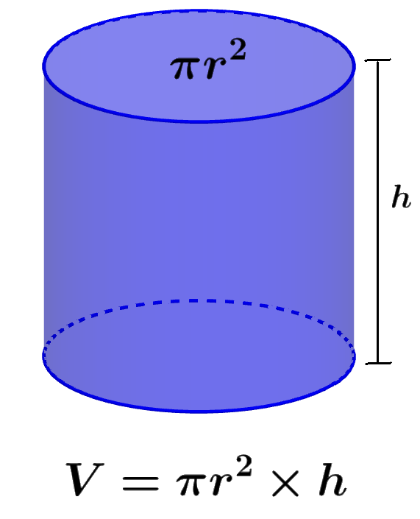
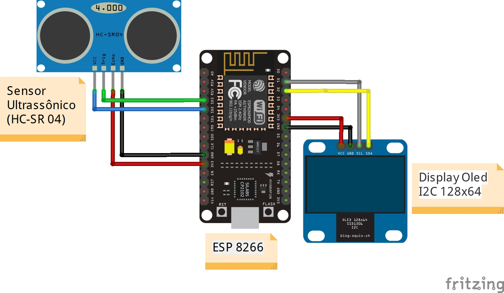
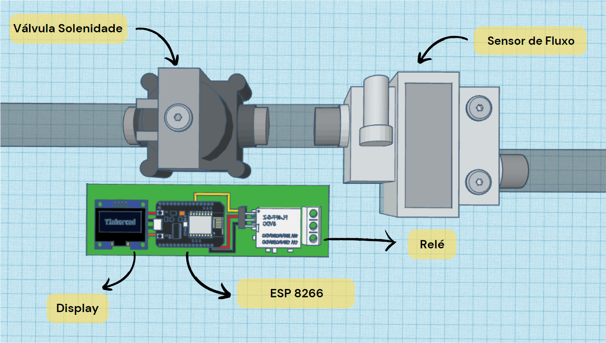
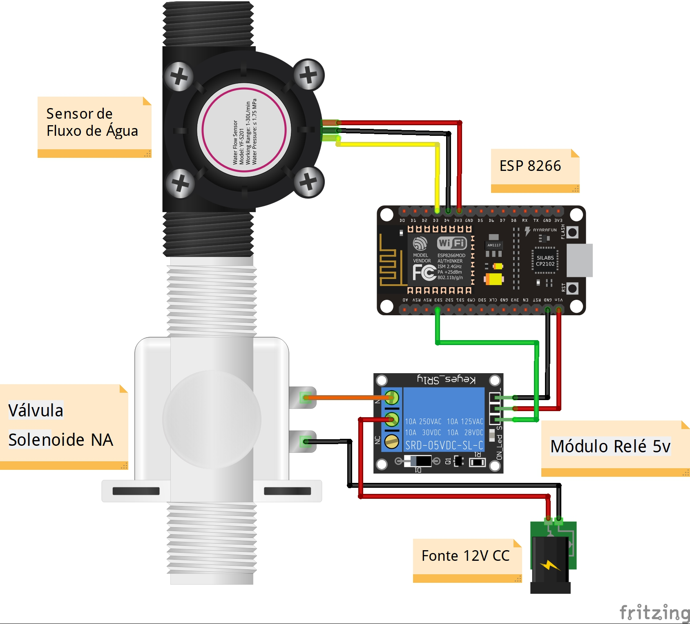
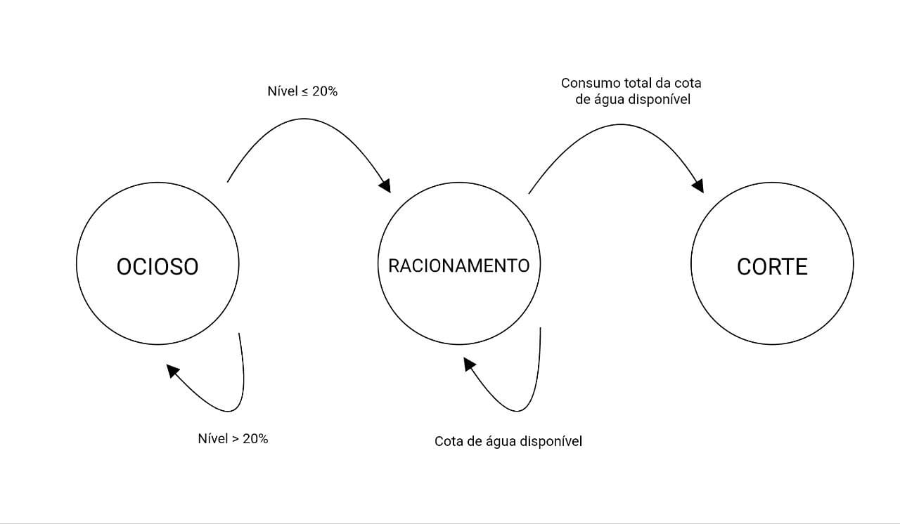
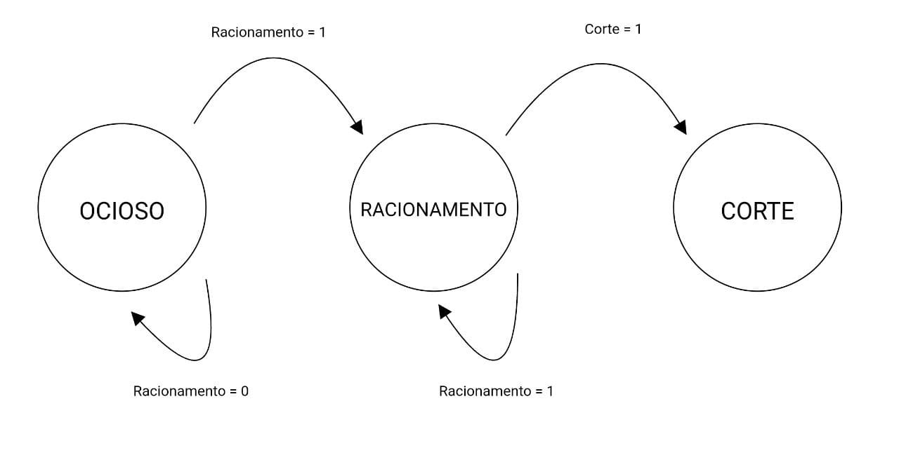

# DESIGN
## _Projeto de Monitoramento e Racionamento de Água Inteligente para Residências_
### Simulação 3D disponivel em: (https://www.tinkercad.com/things/hGWQ0mMNCCw-magnificent-vihelmo/edit?sharecode=4iyoHfetYSLfNYWV_F5b0prEbmNWXiNemqBtOnMB-_I)


### CIRCUITO DE CONTROLE DE NÍVEL E PROCESSAMENTO DE DADOS
#### Modelo 3D do circuito de controle de nível e processamento de dados

### Sensor Ultrassónico: 
No projeto, o sensor ultrassônico é instalado na parte superior da caixa d'água, desempenha um papel fundamental ao possibilitar a medição precisa do nível da água na caixa d'água. Este dispositivo utiliza ondas sonoras de alta frequência para calcular a distância entre o sensor e a superfície da água. A operação básica desse sensor consiste na emissão de pulsos ultrassônicos e na medição do tempo necessário para que esses pulsos sejam refletidos de volta ao sensor.
#### Funcionamento Básico:
- Emissão de Pulsos: O sensor ultrassônico é instalado na parte superior da caixa d'água e emite pulsos ultrassônicos em direção à superfície da água.
- Reflexão e Detecção: Os pulsos são refletidos pela superfície da água e detectados pelo sensor.
- Cálculo da Distância: Com base no tempo de ida e volta dos pulsos, o sensor calcula a distância até a superfície da água, fornecendo uma medida precisa do nível.

No entanto, para determinar o volume de água na caixa d'água, é crucial conhecer as dimensões internas da caixa. Assumindo que a caixa d'água segue uma forma cilíndrica, a fórmula para calcular o volume (V) é adaptada para essa geometria específica:
####V=π*r^2*(h-D)
Onde:
- r é o raio da base da caixa d'água
- h é a altura da caixa d’água
- D é a distância do sensor e a superfície da água
#### Explicação da Fórmula:
- π⋅r^2 representa a área da base da caixa d'água.
- (h-D) é a distância do fundo do reservatório ate a superfície da água.

Portanto, multiplicando a área da base pela altura da água, obtém-se o volume da água na caixa acima da profundidade inicial.

### Display OLED:
Um display OLED 128x64 I2C é um tipo de tela de visualização que usa a tecnologia OLED (Organic Light-Emitting Diode) para exibir informações. O tamanho específico é de 128 pixels por 64 pixels, e a interface de comunicação é I2C.
### ESP 8266 (Caixa d’água):
No âmbito deste projeto, o microcontrolador ESP8266 desempenha um papel central como o cérebro do sistema, encarregado de receber e processar dados vitais provenientes dos sensores. Este componente essencial está conectado a diversos dispositivos, permitindo uma gestão inteligente e em tempo real do nível de água na caixa. Sendo que as principais funções do ESP8266 são:
- Recepção de Dados dos Sensores: O ESP8266 recebe dados diretamente e indiretamente dos sensores, sendo o intermediário crucial para a obtenção das informações necessárias.
- Sensor Ultrassônico: O sensor ultrassônico fornece dados sobre a distância da superfície da água. O ESP8266 processa esses dados, utilizando fórmulas específicas para calcular o volume de água na caixa d'água.
- Display como Interface: O ESP8266 está vinculado a um display, proporcionando uma interface visual que permite aos usuários monitorar o nível atual de água. Essa representação gráfica torna as informações facilmente compreensíveis.
- Comunicação via Wi-Fi: O ESP8266 está integrado à rede Wi-Fi, a comunicação entre dispositivos e feita através do protocolo MQTT com a intervenção de um Broker. Isso permite que o microcontrolador receba informações relevantes de outros sensores.
- Envio de Dados do Nível de Reservatório: O ESP8266 não apenas recebe dados do sensor ultrassônico, mas também envia informações sobre o nível do reservatório para outros dispositivos conectados ao mesmo broker. Essa comunicação bidirecional é essencial para manter todos os componentes do sistema sincronizados.
### Esquemático do circuito de controle de nível e processamento de dados:


Este circuito tem como principal função a medição precisa do volume de água em um reservatório, bem como a recepção e processamento de dados dos sensores. Conectado ao ESP (ESP8266), o sensor ultrassônico é alimentado por 5V e GND, com as saídas Trigger e Echo conectadas às entradas D3 (GPIO 10) e D2 (GPIO 9), respectivamente.

Também conectados ao ESP temos o display OLED de 128x64 pixels. Esse display é alimentado com 3.3V e GND do ESP, enquanto as portas de comunicação SCL e SDA do display estão conectadas às portas D1 (GPIO5) e D2 (GPIO4) do ESP, respectivamente. Essas portas são comumente usadas para comunicação I2C.

A comunicação I2C é um protocolo serial usado para a transferência de dados entre dispositivos em um circuito. Ele permite que vários dispositivos compartilhem informações eficientemente em um barramento comum, facilitando a comunicação bidirecional. Cada dispositivo I2C possui um endereço único para identificação, tornando a interação entre o controlador principal e os dispositivos periféricos rápida e confiável.
### Pinagem do NodeMCU ESP8266

### Código de medição de nível de água
```cpp
//Bibliotecas para o controle do display
#include <SPI.h>
#include <Wire.h>
#include <Adafruit_GFX.h>
#include <Adafruit_SSD1306.h>
#include <Fonts/FreeSerif12pt7b.h>

// Biblioteca Ultrasonic
#include <Ultrasonic.h> 

// Define altura e largura do display (em pixels)
#define LARGURA_OLED 128
#define ALTURA_OLED 64
 
 //Como o OLED que estamos utilizando não possui um pino RESET, enviamos -1 ao construtor para que nenhum dos pinos do Arduino seja utilizado como um reset para o display.
#define RESET_OLED -1
 
//Objeto display, para que o controle possa ser feito biblioteca Adafruit SSD1306.
Adafruit_SSD1306 display(LARGURA_OLED, ALTURA_OLED, &Wire, RESET_OLED);


// Define os pinos para o sensor ultrassônico
const int triggerPin = 10;  // Pino de disparo (Trigger)
const int echoPin = 9;     // Pino de eco (Echo)

Ultrasonic ultrasonic(triggerPin, echoPin);// Cria uma instância do objeto Ultrasonic


void setup() {
  Serial.begin(115200);
  display.begin(SSD1306_SWITCHCAPVCC, 0x3C);
  display.clearDisplay();

}
void loop() {
  // Medir a distância em centímetros
  float distancia_cm = ultrasonic.read(CM);

  // Imprimir a distância no Monitor Serial
  Serial.print("Distancia: ");
  Serial.print(distancia_cm);
  Serial.println(" cm");

 // Imprimir a distância no Display OLED
  display.clearDisplay();
  display.setTextSize(3);
  display.setTextColor(WHITE);
  display.setCursor(0,10);
  display.println(distancia_cm);
  display.print("cm");
  display.display();
  delay(500);
  }
 ```
O código acima é um exemplo de como integrar o sensor ultrassónico e o display. Esse código tem a função de apenas medir a distância de uma superfície até o sensor ultrassónico e imprimir o resultado no display.
#### Bibliotecas
- Ultrasonic.h: Para simplificar a integração e o uso do sensor ultrassônico, o projeto faz uso da biblioteca Ultrasonic.h. Essa biblioteca fornece funções pré-programadas que facilitam a leitura e o processamento dos dados provenientes do sensor.
- Wire.h:  A biblioteca Wire é usada para comunicação I2C. I2C (Inter-Integrated Circuit) é um protocolo de comunicação comumente utilizado para conectar periféricos de baixa velocidade, como sensores, Displays e outros microcontroladores.
- Adafruit_GFX.h: Esta biblioteca faz parte da Adafruit Graphics Library e fornece um conjunto de funções gráficas para desenhar formas e texto em displays. É frequentemente usada com displays como TFT (Thin-Film Transistor) ou OLED (Organic Light-Emitting Diode).
- Adafruit_SSD1306.h: Esta biblioteca é especificamente projetada para displays OLED baseados no chip controlador SSD1306. Displays OLED são conhecidos por seu alto contraste e podem ser usados para exibir gráficos e texto.
- Fonts/FreeSerif12pt7b.h: Parece ser um arquivo de fonte personalizado, provavelmente parte de uma biblioteca maior. Fontes são usadas para renderizar texto em displays gráficos, e este arquivo parece conter uma fonte específica (FreeSerif12pt7b) em um formato adequado para uso com a biblioteca gráfica da Adafruit.

### Código de comunicação wi-fi (Envio de dados) 
```cpp
#include <ESP8266WiFi.h> 
#include <PubSubClient.h>

// Inclua a biblioteca Ultrasonic
#include <Ultrasonic.h>

//WiFi
const char* SSID = "Apollo2.4";                // SSID / nome da rede WiFi que deseja se conectar
const char* PASSWORD = "Binho2000@";   // Senha da rede WiFi que deseja se conectar
WiFiClient wifiClient;    

//MQTT Server
const char* BROKER_MQTT = "test.mosquitto.org"; //URL do broker MQTT que se deseja utilizar
int BROKER_PORT = 1883;                      // Porta do Broker MQTT

// Define os pinos para o sensor ultrassônico
const int triggerPin = 5;  // Pino de disparo (Trigger)
const int echoPin = 4;     // Pino de eco (Echo)

#define ID_MQTT  "BCI2000"            //Informe um ID unico e seu. Caso sejam usados IDs repetidos a ultima conexão irá sobrepor a anterior. 
#define TOPIC_PUBLISH "BCIDist@ancia"    //Informe um Tópico único. Caso sejam usados tópicos em duplicidade, o último irá eliminar o anterior.
PubSubClient MQTT(wifiClient);        // Instancia o Cliente MQTT passando o objeto espClient

// Cria uma instância do objeto Ultrasonic
Ultrasonic ultrasonic(triggerPin, echoPin);

//Declaração das Funções
void mantemConexoes();  //Garante que as conexoes com WiFi e MQTT Broker se mantenham ativas
void conectaWiFi();     //Faz conexão com WiFi
void conectaMQTT();     //Faz conexão com Broker MQTT
void enviaPacote();     //

void setup() {       

  Serial.begin(115200);

  conectaWiFi();
  MQTT.setServer(BROKER_MQTT, BROKER_PORT);   
}

void loop() {
  mantemConexoes();
  enviaValores();
  MQTT.loop();
}

void mantemConexoes() {
    if (!MQTT.connected()) {
       conectaMQTT(); 
    }
    
    conectaWiFi(); //se não há conexão com o WiFI, a conexão é refeita
}

void conectaWiFi() {

  if (WiFi.status() == WL_CONNECTED) {
     return;
  }
        
  Serial.print("Conectando-se na rede: ");
  Serial.print(SSID);
  Serial.println("  Aguarde!");

  WiFi.begin(SSID, PASSWORD); // Conecta na rede WI-FI  
  while (WiFi.status() != WL_CONNECTED) {
      delay(100);
      Serial.print(".");
  }
  
  Serial.println();
  Serial.print("Conectado com sucesso, na rede: ");
  Serial.print(SSID);  
  Serial.print("  IP obtido: ");
  Serial.println(WiFi.localIP()); 
}

void conectaMQTT() { 
    while (!MQTT.connected()) {
        Serial.print("Conectando ao Broker MQTT: ");
        Serial.println(BROKER_MQTT);
        if (MQTT.connect(ID_MQTT)) {
            Serial.println("Conectado ao Broker com sucesso!");
        } 
        else {
            Serial.println("Noo foi possivel se conectar ao broker.");
            Serial.println("Nova tentatica de conexao em 10s");
            delay(10000);
        }
    }
}

void enviaValores() {

  // Medir a distância em centímetros
  float distancia_cm = ultrasonic.read(CM);

  // Imprimir a distância no Monitor Serial
  Serial.print("Distancia: ");
  Serial.print(distancia_cm);
  Serial.println(" cm");

  // Aguardar um curto período de tempo antes da próxima leitura
  delay(750);

  // Manda valor da distancia     
  String mensagem = String(distancia_cm, 2);  // 2 casas decimais
  MQTT.publish(TOPIC_PUBLISH, mensagem.c_str());  // Converte a String para const char* usando c_str()
  Serial.println("Valor enviado.");
      
}
``` 
Esse código é um exemplo de como a comunicação entre os ESP será feita, mostra como um dispositivo ESP8266, equipado com um sensor ultrassônico, pode medir a distância e enviar esses dados para um servidor MQTT pela internet. Outros dispositivos conectados à mesma rede MQTT podem então receber essas informações.

O MQTT (Message Queuing Telemetry Transport) é um protocolo leve e eficiente de comunicação para a Internet das Coisas (IoT). Ele utiliza um modelo de publicação/assinatura, onde os dispositivos podem enviar (publicar) e receber (assinar) mensagens por meio de um intermediário central chamado broker (servidor intermediário). O MQTT é conhecido por sua eficiência em ambientes com largura de banda limitada e alta latência. Ele suporta diversos níveis de garantia de entrega, possui tópicos para organizar mensagens e é amplamente utilizado para a troca de dados em sistemas IoT.
#### Bibliotecas
- ESP8266WiFi.h: Esta biblioteca é específica para o ESP8266 e fornece funcionalidades para configurar e gerenciar a conexão WiFi do dispositivo. Ela permite que o ESP8266 se conecte a redes WiFi, obtenha endereços IP, e mantenha uma conexão estável.
- PubSubClient.h: Esta biblioteca é uma implementação MQTT para o ESP8266. Ela facilita a comunicação usando o protocolo MQTT, permitindo que o ESP8266 publique mensagens em tópicos e assine tópicos para receber mensagens.

## CIRCUITO DE CONTROLE DE FLUXO
### Modelo 3D do circuito de controle de fluxo:

### Válvula solenoide:
Uma válvula solenoide é um dispositivo eletromecânico que controlara o fluxo de água, através de uma abertura ou fechamento controlado por um campo magnético gerado por uma bobina solenoide.  Será responsável por interromper o fluxo de água quando o usuário exceder o consumo de água no modo racionamento
- Racionamento de Água: Quando limites de consumo são atingidos o ESP ativa a válvula e interromper o fluxo de água.
- Relé como Chave de Controle: O relé atua como uma chave de controle entre o ESP e a válvula solenoide. Quando o ESP emite um sinal elétrico para ativar a válvula solenoide, esse sinal é enviado para o relé.
- Ativação da Válvula Solenoide: Válvula solenoide requer uma tensão específica para operar, o relé, ao ser acionado pelo ESP, fornece essa tensão necessária à válvula solenoide. Isso resulta na ativação da válvula, permitindo ou interrompendo o fluxo de água conforme necessário.

### Sensor de fluxo:
Um sensor de fluxo de água é um dispositivo que mede a taxa ou volume de água que passa por ele em um determinado período de tempo. Ele detecta e quantifica o movimento da água em um sistema, proporcionando informações essenciais para monitoramento e controle.
Quando o sistema entra em modo racionamento o sensor de fluxo irá mediar a vazão de água para que seja feito o controle do consumo de água.

### Esquemático do circuito de controle de fluxo:

O projeto final consiste em dois circuitos idênticos ao mencionado anteriormente, simulando o consumo de água em uma residência. O principal propósito é medir o consumo de água e, se necessário, cortar o fornecimento quando o limite estabelecido for ultrapassado.

Conectados ao ESP, temos dois dispositivos principais. Primeiramente, o sensor de fluxo, alimentado com uma tensão de 3.3V e GND. Um fio deste sensor envia pulsos, cuja taxa de rotação está diretamente ligada à velocidade do fluxo de água. Quanto mais rápido a água flui, mais rápido o rotor gira, permitindo assim a medição precisa do consumo de água.

Em seguida, a válvula solenoide, um dispositivo com apenas dois terminais. Para controlar essa válvula e interromper o fluxo de água conforme necessário, é essencial fornecer uma tensão de 12V. Dado que o microcontrolador ESP não pode gerar essa tensão diretamente, optamos por utilizar um relé para controlar a válvula.

O relé é alimentado com uma tensão de 5V e terra (GND) provenientes do ESP. Um fio adicional está conectado à porta GPIO10 (também conhecida como SDD3) do ESP para controlar o relé. Quando o ESP aciona essa porta GPIO10, o relé abre ou fecha, permitindo assim a aplicação ou interrupção da tensão de 12V na válvula solenoide. Desta maneira, conseguimos efetivamente controlar o fluxo de água através da válvula.

Este código é uma implementação de um dispositivo ESP8266 que atua como um cliente MQTT, sendo capaz de se conectar a uma rede Wi-Fi e a um broker MQTT para receber informações de sensores. Ele é projetado para interagir com um sensor ultrassônico que envia dados para um tópico específico no broker MQTT. Isso permite que o dispositivo receba essas informações de sensores de qualquer lugar do mundo, desde que ambos os dispositivos (o sensor e o ESP8266) estejam conectados à internet.
### Código de comunicação wi-fi (Recebimento de dados)
``` cpp
#include <ESP8266WiFi.h> 
#include <PubSubClient.h>

//Bibliotecas para o controle do display
#include <SPI.h>
#include <Wire.h>
#include <Adafruit_GFX.h>
#include <Adafruit_SSD1306.h>
#include <Fonts/FreeSerif12pt7b.h>


//WiFi
const char* SSID = "Apollo2.4";                // SSID / nome da rede WiFi que deseja se conectar
const char* PASSWORD = "Binho2000@";   // Senha da rede WiFi que deseja se conectar
WiFiClient wifiClient;                         
 
//MQTT Server
const char* BROKER_MQTT = "test.mosquitto.org"; //URL do broker MQTT que se deseja utilizar
int BROKER_PORT = 1883;                      // Porta do Broker MQTT

// Define altura e largura do display (em pixels)
#define LARGURA_OLED 128
#define ALTURA_OLED 64
#define RESET_OLED -1

#define ID_MQTT  "BCI2001"             //Informe um ID unico e seu. Caso sejam usados IDs repetidos a ultima conexão irá sobrepor a anterior. 
#define TOPIC_SUBSCRIBE "BCIDist@ancia"   //Informe um Tópico único. Caso sejam usados tópicos em duplicidade, o último irá eliminar o anterior.

PubSubClient MQTT(wifiClient);        // Instancia o Cliente MQTT passando o objeto espClient

//Objeto display, para que o controle possa ser feito biblioteca Adafruit SSD1306.
Adafruit_SSD1306 display(LARGURA_OLED, ALTURA_OLED, &Wire, RESET_OLED);


//Declaração das Funções
void mantemConexoes();  //Garante que as conexoes com WiFi e MQTT Broker se mantenham ativas
void conectaWiFi();     //Faz conexão com WiFi
void conectaMQTT();     //Faz conexão com Broker MQTT
void recebePacote(char* topic, byte* payload, unsigned int length);

void setup() {     

  Serial.begin(115200);

  display.begin(SSD1306_SWITCHCAPVCC, 0x3C);
  display.clearDisplay();

  conectaWiFi();
  MQTT.setServer(BROKER_MQTT, BROKER_PORT);  
  MQTT.setCallback(recebePacote); 
}

void loop() {
  mantemConexoes();
  MQTT.loop();
}

void mantemConexoes() {
    if (!MQTT.connected()) {
       conectaMQTT(); 
    }
    
    conectaWiFi(); //se não há conexão com o WiFI, a conexão é refeita
}

void conectaWiFi() {

  if (WiFi.status() == WL_CONNECTED) {
     return;
  }
        
  Serial.print("Conectando-se na rede: ");
  Serial.print(SSID);
  Serial.println("  Aguarde!");

  WiFi.begin(SSID, PASSWORD); // Conecta na rede WI-FI  
  while (WiFi.status() != WL_CONNECTED) {
      delay(100);
      Serial.print(".");
  }
  
  Serial.println();
  Serial.print("Conectado com sucesso, na rede: ");
  Serial.print(SSID);  
  Serial.print("  IP obtido: ");
  Serial.println(WiFi.localIP()); 
}

void conectaMQTT() { 
    while (!MQTT.connected()) {
        Serial.print("Conectando ao Broker MQTT: ");
        Serial.println(BROKER_MQTT);
        if (MQTT.connect(ID_MQTT)) {
            Serial.println("Conectado ao Broker com sucesso!");
            MQTT.subscribe(TOPIC_SUBSCRIBE);
        } 
        else {
            Serial.println("Noo foi possivel se conectar ao broker.");
            Serial.println("Nova tentatica de conexao em 10s");
            delay(10000);
        }
    }
}

void recebePacote(char* topic, byte* payload, unsigned int length) 
{
  // Convertendo o payload byte para uma string
  String mensagem;
  for (int i = 0; i < length; i++) {
    mensagem += (char)payload[i];
  }

  // Convertendo a string para um número (distância)
  float distancia_cm = mensagem.toFloat();

  // Imprimir a distância no Monitor Serial
  Serial.print("Distancia: ");
  Serial.print(distancia_cm);
  Serial.println(" cm");

  // Imprimir a distância no Display OLED
  display.clearDisplay();
  display.setTextSize(3);
  display.setTextColor(WHITE);
  display.setCursor(0,10);
  display.println(distancia_cm);
  display.print("cm");
  display.display();
  delay(500);
}
``` 
 Código acima é um complemento do código de envio de dados, atuando como um cliente MQTT, sendo capaz de se conectar a uma rede Wi-Fi e a um broker MQTT para receber informações de sensores. Ele é projetado para interagir com um sensor ultrassônico que envia dados para um tópico específico no broker MQTT. Isso permite que o dispositivo receba essas informações de sensores de qualquer lugar do mundo, desde que ambos os dispositivos (o sensor e o ESP8266) estejam conectados à internet.
 
## DIAGRAMA DE FUNCIONAMENTO 
### Máquina de estados (Circuito de controle de nível e processamento de dados) 

#### Estado Inicial (OCIOSO):
Descrição: O sistema está ocioso, monitorando continuamente o nível de água
##### Ações:
- Imprime o nível de água no display.

##### Transições:
- Se o nível de água for superior a 20%, permanece no estado ocioso.
- Se o nível de água atingir ou cair abaixo de 20%, transição para o estado de racionamento.

#### Estado de racionamento:
Descrição: O sistema identificou que o nível de água está abaixo de 20%, indicando a necessidade de racionamento.
##### Ações:
- Envia a variável racionamento = 1 para o servidor.
- Dividi o valor de litros de água disponível na caixa igualitariamente para cada residência.
- Faz a requisição para o servidor do consumo atual de casa residência.
- Monitora e registra o consumo volumétrico de água de cada residência.
- Se determinada residência atingir sua cota de volume de água, transição para o estado de corte.

#### Estado corte:
Descrição: O sistema identificou que o consumo da residência foi excedido, indicando a necessidade de corte fornecimento de água.
##### Ações: 
- Envia para o servidor a id da residência que deve ter o fornecimento de água cortado. 

### Máquina de estados (Circuito de controle de fluxo)

#### Estado Inicial (OCIOSO):
Descrição: Monitora se o sistema deve entrar em modo racionamento.
##### Ações: 
- Requisita o valor da variável racionamento para o servidor.
##### Transições:
- Se racionamento diferente de ‘1’, mentem-se no estado atual.
- Se racionamento = 1, transição para o estado de racionamento.
#### Estado de racionamento: 
Descrição: O sistema identificou que é necessário entrar em modo racionamento.
##### Ações: 
- Monitora o fluxo de água de cada residência e envia as informações para o servidor.
- Verifica no servidor existe registro do seu ID. 
##### Transições:
- Se de o ID estiver no servidor, entrar no estado corte
- Se o ID não estiver na lista, permanece no estado atual.
#### Estado corte:
Descrição: O sistema identificou que é necessário de cortar o fornecimento de água na residência.
##### Ações: 
- Aciona a válvula solenoide.


