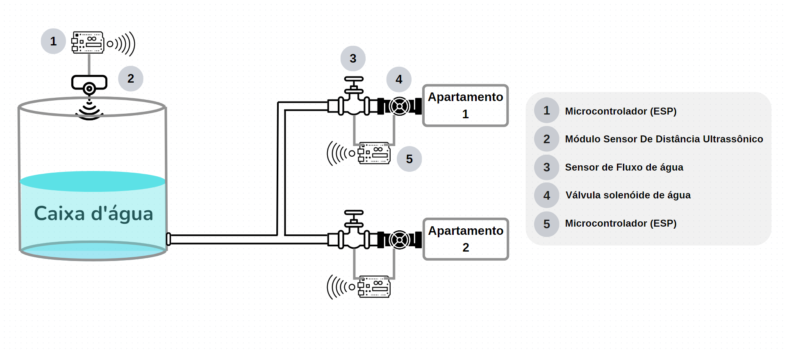

# CONCEIVE
## _Projeto de Monitoramento e Racionamento de Água Inteligente para Residências_

O Projeto de Monitoramento e Racionamento de Água Inteligente é uma solução inovadora que harmoniza tecnologia e sustentabilidade para criar um ambiente residencial mais consciente e eficiente na utilização da água, contribuindo para um futuro mais sustentável, com recursos hídricos preservados e um uso equitativo dos mesmos. O sistema, fundamentado em tecnologias de Internet das Coisas (IoT) e automação, tem como objetivo monitorar o nível de água em uma caixa d'água central, gerenciar o fluxo de água para cada residência e acionar um modo de racionamento quando necessário.

## Fluxo de Funcionamento:

- O funcionamento do sistema é viabilizado por microcontroladores ESP8266 ou ESP32 instalados em cada residência conectada à rede, assim como na caixa d’água, monitorando o nível de água.
- O dispositivo (Módulo sensor de distância ultrassônico) situado na caixa d'água mensura o nível da água. Quando o nível atinge ou cai abaixo de 20% da capacidade, o sistema é acionado para entrar no modo de racionamento.
- Cada microcontrolador em uma residência é encarregado de controlar uma válvula solenoide de água e um sensor de fluxo de água, permitindo a vigilância precisa e o controle do consumo de água.
- Todos os microcontroladores estão conectados através de uma rede Wi-Fi interna, habilitando a troca de informações entre a caixa d'água e as residências.
- Os dados de consumo são enviados para o sistema central da caixa d'água, que coordena o racionamento com base nas leituras.
- No modo de racionamento, o sistema assume o controle do fluxo de água em cada residência. Isso é concretizado mediante a regulação das válvulas solenoides com base na cota de consumo permitida para cada domicílio.
- Cada residência desfruta de um consumo igualitário de água durante o período de racionamento, garantindo que todos os lares tenham acesso imparcial aos recursos hídricos disponíveis.
- Os moradores têm a possibilidade de receber notificações, por meio do aplicativo móvel, acerca do racionamento e monitorar seu consumo de água por intermédio de aplicativos móveis ou painéis de exibição.

## Componentes-Chave:

- Microcontrolador ESP8266/ESP32: Cada casa conectada possui um ESP que controla uma válvula solenoide de água e um sensor de fluxo. Isso permite a medição precisa do consumo de água e o controle do fluxo.
- Sensor de Nível de Água: Localizado na caixa d'água, o módulo sensor de distância ultrassônico monitora o nível da água, ativando o racionamento quando o nível atinge um limite pré-definido.
- Sensor de fluxo de água: O sensor de fluxo de água é responsável por medir a quantidade de água que passa por ele. Isso permite o acompanhamento preciso do consumo de água em cada residência.
- Válvula solenoide de água: É um dispositivo que controla o fluxo de água nas residências. Ela pode ser aberta para permitir o fluxo de água ou fechada para interrompê-lo.
- Rede Wi-Fi: Uma rede interna Wi-Fi conecta os dispositivos ESP em todas as residências e na caixa d'água, possibilitando a troca de informações em tempo real.
- Comunicação MQTT: Através do protocolo MQTT, os dispositivos compartilham dados e instruções, permitindo a coordenação do racionamento e a transmissão de notificações.
- Aplicativo de Monitoramento: Um aplicativo móvel permite que os moradores monitorem seu consumo de água, recebam notificações sobre o racionamento e ajustem suas configurações pessoais. 

