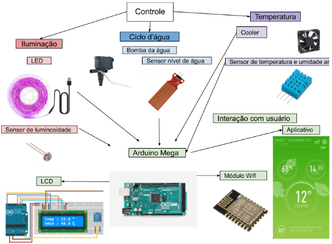
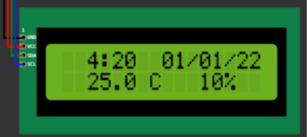
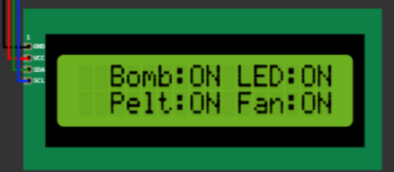

# ESTUFA HIDROPÔNICA VERTICAL INTELIGENTE
# CONCEIVE
A Estufa Hidropônica Vertical Inteligente é uma solução inovadora que combina tecnologia e práticas sustentáveis para criar um ambiente controlado e eficiente para o cultivo de hortaliças. Este sistema utiliza tecnologias de Internet das Coisas (IoT) e automação para otimizar o processo de cultivo. 

O principal objetivo dessa estufa é manter condições ideais para o crescimento das plantas, incluindo o monitoramento do nível de água, o gerenciamento do ciclo de água às plantas e o ajuste da temperatura e da luminosidade. Isso resulta em um cultivo mais eficiente e sustentável, com economia de água e espaço, contribuindo para um futuro mais ecológico.
### Concepção do Sistema de Controle para Estufa Hidropônica Inteligente
A concepção do sistema de controle para uma estufa hidropônica inteligente é o resultado de uma abordagem orientada para a eficiência e sustentabilidade, harmonizando tecnologia e funcionalidade. O sistema é impulsionado por microcontroladores ATMEGA, que desempenham um papel fundamental na orquestração do ambiente de cultivo, garantindo o bem-estar das plantas.
### Eficiência e Sustentabilidade
Um dos pilares desse projeto é a eficiência, tanto no consumo de água quanto na ocupação do espaço. A solução busca ser compacta e inteligente, proporcionando um ambiente ideal para o cultivo hidropônico.
### Integração Inteligente de Dispositivos Para Controle de Ambiente Preciso
O Módulo Sensor de Temperatura monitora constantemente a temperatura do ar na estufa. Quando a temperatura se desvia da faixa desejada para o cultivo das hortaliças, o sistema aciona a ventilação para manter o ambiente ideal. Da mesma forma, o Sensor de Luminosidade avalia a quantidade de luz presente na estufa e permite ao microcontrolador ajustar a intensidade luminosa de acordo com as necessidades de crescimento das plantas.
### Gerenciamento de Recursos Hídricos
A bomba d'água desempenha um papel essencial na circulação da água nos reservatórios e na mistura do substrato. Isso garante que as plantas recebam a quantidade adequada de água e nutrientes para um crescimento saudável.
Além disto é medido o nível do reservatório de água através do Módulo Sensor de Nível de Água, quando abaixa sua capacidade, o sistema notifica o usuário, quanto à consumo estimado e necessidade de reposição.
### Conectividade e Comunicação
Todos esses módulos estão interconectados por meio do microcontrolador, que utiliza uma rede Wi-Fi interna para possibilitar a troca de informações entre a estufa e seus usuários. Os dados de monitoramento e o desempenho de cada sistema de controle são apresentados em uma interface de usuário através de um display LCD e também por meio do sistema de comunicação interno.

## DIAGRAMA DE FUNCIONAMENTO

**Figura 1 - Diagrama de funcionamento**

## COMPONENTES E CIRCUITOS CHAVES
### SISTEMA CONTROLE DOS SISTEMAS E COMUNICAÇÃO
Arduino Mega -> O Arduino Mega é a unidade central de processamento que coordena todas as operações da estufa hidropônica vertical. Ele recebe dados dos sensores, controla os dispositivos como a fita de LED, cooler e bomba d'água, e se comunica com o módulo Wi-Fi para permitir o monitoramento remoto e a interação com o sistema.

### SISTEMA CONTROLE DE ILUMINAÇÃO
Fotoresistor -> O fotoresistor é um componente fundamental para a estufa, pois ele detecta a intensidade de luz no ambiente. Com base na leitura do fotoresistor, o sistema pode ajustar a iluminação fornecida pela fita de LED para garantir que as plantas recebam a quantidade ideal de luz durante as diferentes fases de crescimento. 

Fita de LED -> Desempenha um papel crucial na iluminação da estufa hidropônica vertical. Ela pode ser controlada para fornecer luz de espectro apropriado para o crescimento das plantas, simulando as condições de luz solar ideais.
### SISTEMA CONTROLE DE TEMPERATURA
Sensor de Temperatura e Umidade (DHT22) -> O sensor de temperatura e umidade DHT22 é responsável por monitorar as condições ambientais dentro da estufa. Ele mede tanto a temperatura quanto a umidade, informações essenciais para otimizar o crescimento das plantas. Com base nessas leituras, o sistema poderá ajustar a temperatura e a umidade, se necessário.

Cooler -> O cooler tem a função de regular a temperatura interna da estufa hidropônica vertical. Quando as leituras do sensor de temperatura indicam que a temperatura está acima do desejado para o cultivo das plantas, o cooler será acionado para reduzir a temperatura, mantendo um ambiente propício ao crescimento.

### SISTEMA CONTROLE DE CIRCULAÇÃO DE ÁGUA
Bomba d'Água -> A bomba d'água é responsável por circular a água e nutrientes no sistema hidropônicos, garantindo que as plantas recebam a quantidade adequada de água e nutrientes. O microcontrolador será responsável por executar rotinas de funcionamento, e o acionamento da bomba d'água está entre uma das ações.

### SISTEMA MONITORAMENTO DO NÍVEL DE ÁGUA
Sensor de Nível de Água -> O sensor de nível de água monitora o nível do reservatório de água na estufa hidropônica. Essa informação é crucial para garantir que as plantas recebam água suficiente. Quando o nível de água cai abaixo de um limite pré-definido, o sistema poderá notificar o usuário a necessidade de reposição de água nos reservatórios.

### COMUNICAÇÃO HTTP
Módulo Wi-Fi -> O módulo Wi-Fi estabelece a conectividade da estufa com a rede, permitindo que através de métodos HTTP os dados sejam acessados remotamente por meio de dispositivos móveis ou computadores. Isso possibilita o acompanhamento em tempo real do ambiente da estufa e o controle à distância.

### INTERFACE DO USUÁRIO E APLICATIVO
Shield LCD 16x2 com Botões -> O shield LCD 16x2 com botões fornece uma interface de usuário local para monitorar e controlar o sistema da estufa hidropônica vertical. Ele exibe informações como temperatura, umidade e status de operação do sistema, e os botões podem ser usados para ajustar configurações e parâmetros de cultivo.

**Figura 2 - Exemplo Tela de Monitoramento**

**Figura 3 - Exemplo Tela de Controle**

Aplicativo -> O aplicativo é o responsável por mandar e receber informações para estufa, permitindo que os usuários/dono monitorem os estados de operação e condições do ambiente da estufa.

