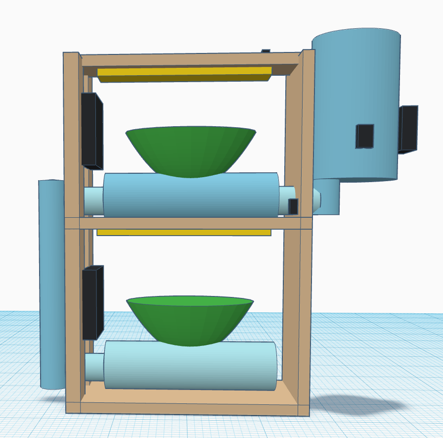
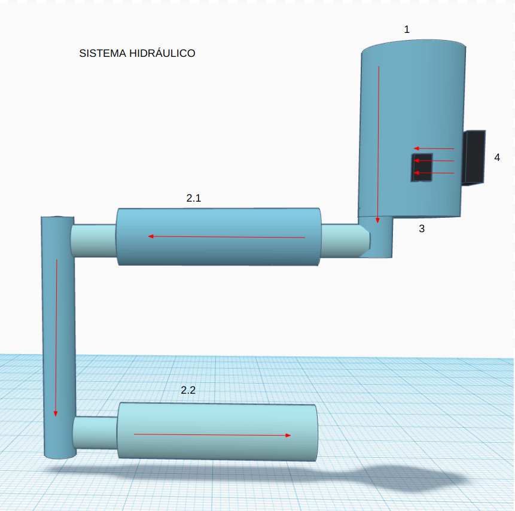
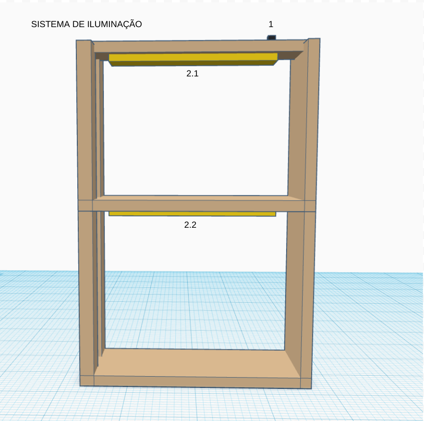
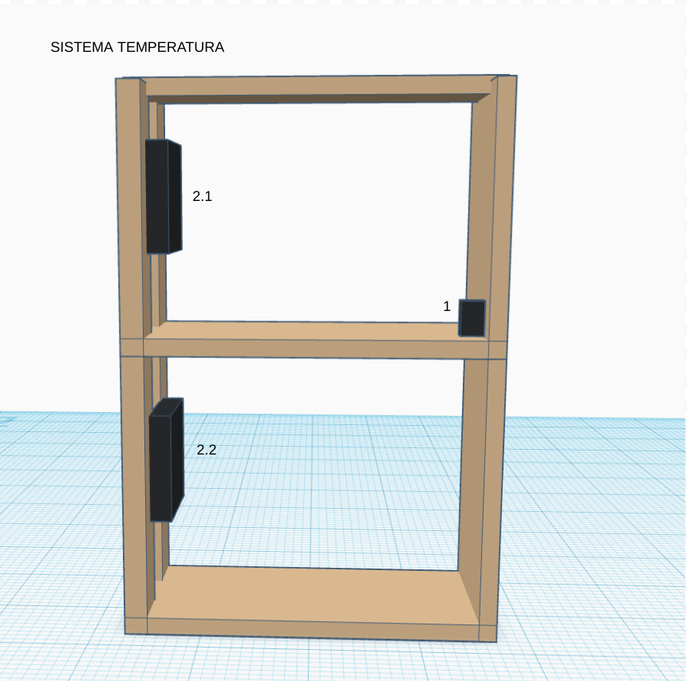
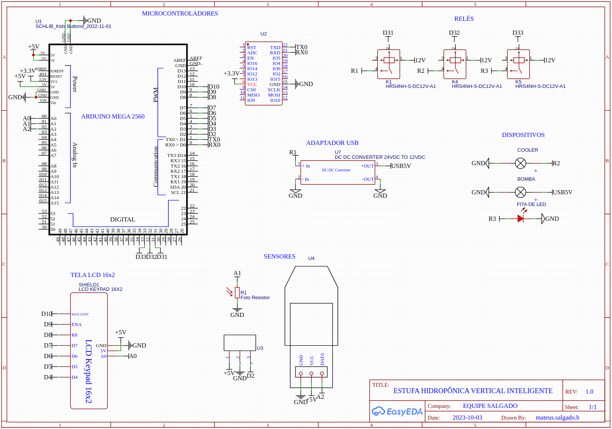
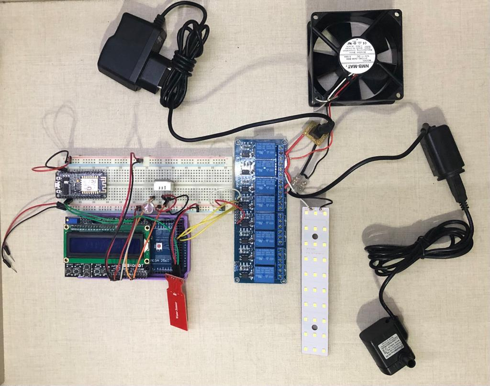
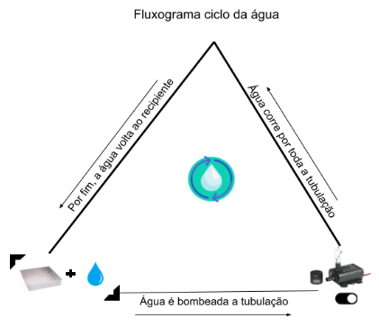
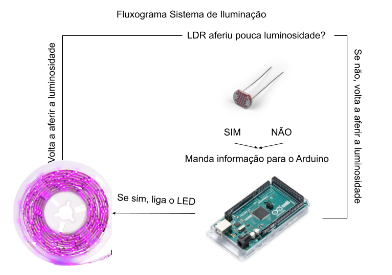
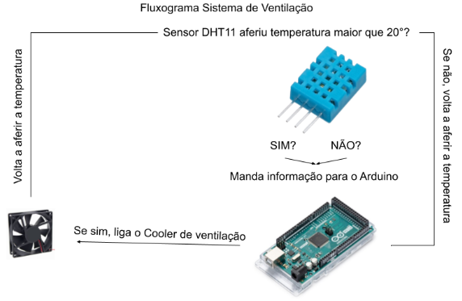
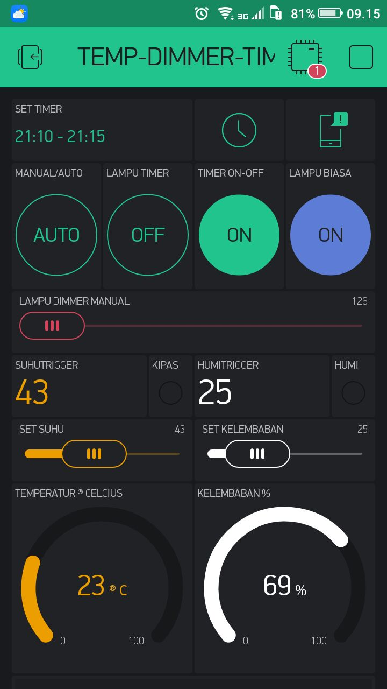

# ESTUFA HIDROPÔNICA VERTICAL INTELIGENTE
# DESIGN
Para melhor entendimento e planejamento dos componentes e sistemas presente na Estufa Hidropônica Vertical Inteligente, o projeto será divido em 3 grandes tópicos.
- Planta Mecânica
- Planta Eletrônica
- Diagramas de Funcionamento do Sistema

## PLANTA MECÂNICA
Podemos observar na figura abaixo os componentes e disposição dos mesmos nos sistemas. Será abordado de forma individual cada grupo de componentes.
- Sistema Hidráulico
- Sistema de Iluminação
- Sistema Temperatura

**Figura 1 - Planta Mecânica do Projeto Final**

### SISTEMA HIDRÁULICO
O design do sistema hidropônico foi cuidadosamente elaborado para assegurar uma circulação eficiente da água na estufa vertical, conforme indicado pelas setas na Figura 2 - Planta Mecânica do Sistema Hidráulico. Uma abordagem notável deste projeto é o foco na reutilização e reciclagem de materiais, alinhando-se a princípios sustentáveis.

**Figura 2 - Planta Mecânica do Sistema Hidráulico**

### Legenda dos Componentes

1. Reservatório de Água (Garrafa 3L):
O reservatório de água desempenha um papel central, armazenando a solução nutritiva que alimentará as plantas. A escolha de uma garrafa de 3 litros sugere uma abordagem econômica e prática.

2. Vaso de Água (Garrafa 1L):
Este vaso de água atua como um ponto de coleta antes da água ser bombeada para a parte superior do sistema hidropônico. A seleção de uma garrafa de 1 litro deve ser avaliada quanto à resistência à pressão da água durante o funcionamento da bomba.

3. Sensor de Nível de Água:
A inclusão do sensor de nível de água é uma medida inteligente, permitindo monitorar e controlar o nível da água no sistema. Isso não apenas protege a bomba contra funcionamento a seco, mas também contribui para a eficiência do sistema.

4. Bomba d'Água:
A bomba d'água desempenha um papel crucial na circulação da solução nutritiva. A escolha de uma bomba adequada ao tamanho e altura da estufa é vital para o sucesso do projeto.

Além desses elementos, a consideração cuidadosa de tubos, conectores e sistemas de irrigação é essencial para garantir uma distribuição eficiente da água e dos nutrientes. 

### SISTEMA ILUMINAÇÃO
O projeto do sistema de iluminação foi concebido com foco na otimização da eficiência luminosa, essencial para o crescimento saudável das plantas na estufa hidropônica vertical. A Figura 3 - Planta Mecânica do Sistema de Iluminação ilustra a disposição desses componentes.

**Figura 3 - Planta Mecânica do Sistema de Iluminação**

#### Legenda de Componentes
1. Sensor de Luminosidade LDR:
O sensor de luminosidade LDR desempenha um papel crucial ao monitorar os níveis de luz na estufa. Isso permite um controle inteligente da iluminação, garantindo que as plantas recebam a quantidade ideal de luz.

2. Fita de LED:
A fita de LED é a fonte de iluminação escolhida para o projeto. Sua disposição na estufa fornece uma distribuição uniforme de luz, fundamental para o crescimento das plantas. A escolha de fitas de LED é uma opção eficiente em termos de energia, oferecendo um espectro de luz adequado para o cultivo.

O uso de um sensor de luminosidade LDR demonstra uma abordagem inteligente para a gestão da iluminação, ajustando-a conforme necessário para economizar energia e criar um ambiente ideal para o desenvolvimento das plantas. 
Além disso, a escolha da fita de LED como fonte de luz é eficiente e econômica, proporcionando o espectro de luz correto para maximizar a fotossíntese e o crescimento das plantas.

### SISTEMA TEMPERATURA
O sistema de controle de temperatura projetado para a estufa hidropônica vertical visa criar um ambiente controlado e estável para o cultivo de plantas, como ilustrado na Figura 4 - Planta Mecânica do Sistema de Temperatura.

**Figura 4 - Planta Mecânica do Sistema de Temperatura**

#### Legenda de Componentes
1. Sensor de Temperatura e Umidade DHT22:
O sensor de temperatura e umidade DHT22 desempenha um papel vital no monitoramento das condições ambientais dentro da estufa. Ele mede tanto a temperatura quanto a umidade do ar, fornecendo dados essenciais para o controle eficaz do ambiente.

2. Cooler 12V:
O cooler de 12V é utilizado como um dispositivo de resfriamento. Ele é ativado conforme necessário, com base nas leituras do sensor DHT22, para manter a temperatura dentro da faixa ideal para o crescimento das plantas.
A integração do sensor DHT22 com o cooler 12V demonstra um controle inteligente da temperatura, garantindo que as condições da estufa permaneçam ideais para as plantas. Quando as temperaturas sobem acima do nível desejado, o cooler é acionado para resfriar o ambiente, protegendo as plantas contra o superaquecimento.

Com esse sistema de controle de temperatura, a estufa hidropônica vertical proporcionará um ambiente estável e propício ao crescimento das plantas, independentemente das flutuações externas de temperatura. A integração de sensores e dispositivos de controle oferece um ambiente de cultivo otimizado, maximizando a qualidade e o rendimento das colheitas.

## PLANTA ELETRÔNICA
### ESQUEMA ELÉTRICO
**Figura 4 - Esquema Elétrico**

#### LIGAÇÕES ELÉTRICAS
##### MICROCONTROLADORES
- Arduino Mega - Será responsável por toda aferição de sensores e controle dos devices de potência.
- Placa de desenvolvimeno ESP32 - Será responsável pela comunicação Wifi com Aplicativo.
##### SENSORES
###### Fotoresistor 
Possui uma resistência que varia conforme à exposição à luz. Será conectado ao pino Analógico A1 para leitura de sua resistência.
###### Sensor de água
Retorna Valores analógicos

    Pino do Sensor	Pino do Arduino
        + VCC	      5V
        - GND             GND
        S 	              A3
      

###### Sensor temperatura umidade DHT22

    Pino do Sensor	Pino do Arduino
        + VCC	      5V
        - GND             GND
        S 	              A2

##### DEVICES DE POTÊNCIA
- Cooler 12V 0.58A 
- Fita de LED
- Bomba d'água
Todos devices de potência estão conectados nos pinos NA do relé, cada um com seu respectivo acionamento individual, dado pelos pinos digitais ao qual o relé está conectado.

##### DEVICES AUXILIARES
###### Conversor USB 12V-5V
Se faz necessário devido à bomba d'água ser de conexão USB e alimentação 5V DC.

###### Módulo Relé
Se faz necessário devido à intuição de controle do funcionamento dos devices de potência. Teremos 12V entre os Terminais NA, e quando houver um sinal lógico em seu in(n) ele fechará a bobina. Sua alimentação lógica é de 5V compartilhando a mesma malha GND do arduino. Cada Pino Digital é respónsável pelo acionamento de um device de potência.

    Pino do Relé	Pino do Arduino
        + VCC	      5V
        - GND             GND
        IN1 	      D31
        IN2 	      D32
        IN3 	      D33

###### Shield LCD 16x2 com botões
Se faz necessário devido à intuição de controle do funcionamento dos devices de potência. É uma Shield já preparada com os pinos os quais devem ser conectados

O display ocupa alguns pinos do Arduino. Segue as conexões para operação no modo 4 bits:

    Sinal do Display	Pino do Arduino
        D4	                    D4
        D5	                    D5
        D6	                    D6
        D7	                    D7
        RS		                D8
        E		                D9
        R/W	                    GND (só escrita)
        D10                     backlight
Como esta é uma configuração padrão, devemos informar estes pinos na definição do objeto LiquidCrystal, como veremos no exemplo.

O potenciômetro no canto superior esquerdo deve ser usado para acertar o contraste do display. Use uma chave de fenda para girar o parafuso até que os caracteres estejam com destaque desejado do fundo.

Como estratégia para economizar portas digitais, a leitura dos botões é feita através de parâmetros analógicos. Os cinco botões estão ligados à entrada analógica A0 através de resistores diferentes. Portanto o botão pressionado pode ser determinado através da tensão medida pelo ADC através de analogRead(A0), onde cada faixa de valor está associada a um botão conforme tabela abaixo:

    Tecla Pressionada	Faixa de Valores
        Direita             < 50
        Cima                >= 50 e < 150
        Baixo               >= 150 e < 300
        Esquerda            >= 300 e < 500
        Select              >= 500 e < 750
        (nenhuma)           >= 750

O shield possui também um botão de Reset, que funciona da mesma forma que o botão de reset do Arduino.

### DESIGN ELETRÔNICO
**Figura 5 - Design Eletrônico**

## DIAGRAMAS DE FUNCIONAMENTO DOS SISTEMAS
### SISTEMA HIDRÁULICO
**Figura 6 - Diagrama de Funcionamento Sistema Hidráulico**

### SISTEMA ILUMINAÇÃO
**Figura 7 - Diagrama de Funcionamento Sistema de Iluminação**

### SISTEMA TEMPERATURA
**Figura 8 - Diagrama de Funcionamento Sistema de Temperatura**

## LISTA DE MATERIAIS
A lista de materiais está descrita no documento "lista_de_materiais.txt".
    
    LISTA DE MATERIAIS
        MATERIAIS LPAE
            2 Fotoresistor
            1 Sensor de água
            1 Sensor temperatura umidade DHT22
            8 Módulo Relé
            1 Shield LCD 16x2 com botões
            1 Arduino Mega
            1 Placa de desenvolvimeno ESP32
        MATERIAIS PRÓPRIOS
            1 Cooler 12V 0.58A
            2 Fita de LED
            1 Conector P4
            1 Conversor USB 12V-5V
            1 Bomba d'água
        MATERIAIS PRÓPRIOS CONSTRUIDOS
            1 Estrutura de Madeira
            1 Sistema Hidráulico
                2 Garrafas PET 1 litro
                1 Garrafas PET 3 litros
                Conexões Hidráulicas
            2 Plantas Hidropônicas

### INTERFACE DO USUÁRIO E APLICATIVO
O projeto apresenta uma abordagem sofisticada para o controle e monitoramento do ambiente da estufa hidropônica vertical, proporcionando aos usuários uma maneira eficaz de interagir com o sistema e acompanhar seu desempenho. A interface do usuário local é fornecida por um Shield LCD 16x2 com botões, enquanto um aplicativo complementar permite o acesso remoto e o gerenciamento conveniente do sistema.

O Shield LCD 16x2 com botões oferece aos usuários uma interface prática para monitorar e controlar o sistema da estufa. O display exibe informações vitais, como temperatura, umidade e status de operação do sistema. Os botões integrados possibilitam aos usuários ajustar configurações e parâmetros de cultivo de forma intuitiva.

**Figura 9 - Exemplo Tela de Monitoramento**

**Figura 10 - Exemplo Tela de Controle**

O aplicativo complementa a interface local, permitindo que os usuários monitorem e controlem o sistema da estufa de forma remota. Ele desempenha um papel crucial no envio e recebimento de informações, permitindo aos usuários verificar o status de operação e as condições ambientais da estufa em tempo real.
O aplicativo oferece conveniência aos usuários, possibilitando o acesso às informações da estufa a partir de qualquer lugar, desde que estejam conectados à internet. Isso permite um controle mais flexível e a capacidade de tomar medidas imediatas, mesmo quando não estão fisicamente na estufa.

**Figura 11 - Exemplo Tela do Aplicativo com Blynk**

