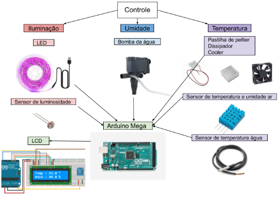

# **ESTUFA HIDROPÔNICA VERTICAL INTELIGENTE**
# **CONCEIVE**

Este projeto consiste em uma estufa hidropônica vertical cuja função é manipular as condições de seu próprio ambiente em busca de um melhor desenvolvimento da hortaliça a ser cultivada, visando a economia de água gerada através de seu sistema hidropônico e tecnológico.

Para que a estufa possa ser inteligente, ou seja, agir na maioria do tempo de forma autônoma, faz-se necessário a implementação de componentes eletrônicos que forneçam espaço para o desenvolvimento de software, sendo esse, o cérebro de todo o sistema, atuando para o controle de temperatura e iluminação do ambiente.

Pode-se observar que com a intensificação das mudanças climáticas, a cada dia o sustento das necessidades básicas do ser humano se torna mais instável. A título de exemplo, os grandes incêndios ocorridos na Grécia, Turquia e Amazônia no ano de 2021 potencializam alterações climáticas que consequentemente originam longos períodos de secas e, ainda, diminuem a capacidade de infiltração da água no solo. Dessa forma, é de suma importância a economia de água, principalmente por parte do setor agrícola, que consome a maior parcela de água no planeta.

Como solução a esta problemática que causará impactos cada vez maiores à sociedade, surge um sistema agrícola que visa uma grande economia de água, sendo essa economia gerada por meio da hidroponia, a qual dispensa o uso de substratos e adubos, pois todos os componentes necessários para o desenvolvimento das hortaliças serão concedidos por uma solução formada por água mais nutrientes.

O projeto tem o objetivo de criar uma solução para efetuar a economia de 95% da água no campo, além de diminuir a área necessária para o plantio, fazendo com que assim haja a diminuição de áreas degradadas pelo meio agrícola, por meio da estufa inteligente. Ainda, se objetiva manipular o ambiente buscando assim um melhor desenvolvimento das plantas e eliminando o uso de agrotóxicos.

Logo a baixo será demonstrado à pesquisa realizada para o desenvolvimento do projeto com base em estudos científicos.

## **Consumo de água no mundo**

De acordo com estimativas feitas pela Organização das Nações Unidas (ONU), até o ano de 2050 a população mundial aumentará em cerca de 2 bilhões de pessoas, ou seja, neste mesmo ano o planeta Terra possuirá aproximadamente 10 bilhões de habitantes (ONU, 2019).

Se, com o objetivo de suprir essa crescente demanda fosse utilizado o sistema agrícola tradicional, que segundo a FAO (Organização das Nações Unidas para a Alimentação e Agricultura), 70% de toda a água consumida no mundo é usada na irrigação das lavouras, na pecuária e na aquicultura, seriam gastas elevadas quantidades de água, alternativa que não seria adequada segundo pesquisas mundiais sobre sustentabilidade, como a formulada pela Organização das Nações Unidas para Alimentação e Agricultura (FAO), que alerta sobre o risco de, no ano de 2050, 2⁄3 da população mundial sofre com escassez de água. Além disso, seriam necessárias maiores porções de terras agricultáveis, fato esse que dificilmente seria sanado, pois, a Organização das Nações Unidas (ONU) estima que 80% das terras com condições favoráveis ao cultivo agrícola estão comprometidas.

Somado a esses problemas, surge o aquecimento global, que influencia diretamente no desequilíbrio climático mundial, o que, consequentemente, impacta o desenvolvimento das culturas mundiais, especialmente aquelas mais frágeis a altas amplitudes térmicas, como a alface (_Lactuca sativa_).

## **Área territorial ocupada pela agricultura**

A área agrícola do Brasil cresceu 3,3% entre 2016 e 2018, de acordo com levantamento divulgado pelo Instituto Brasileiro de Geografia e Estatística (G1, 2020).

O Monitoramento da Cobertura e Uso da Terra mostra que, desde o início da série histórica da pesquisa, em 2000, a área agrícola cresceu 44,8%, chegando a 664.784 km² em 2018, o equivalente a 7,6% do território nacional, considerando a parte terrestre e marítima do país.

Ainda surge outro contraponto: o problema alimentar. Normalmente, as grandes propriedades transferem a produção para o mercado externo, enquanto os alimentos básicos são colocados de lado. Numerosos estudos estimam que mais da metade da produção de alimentos consumidos no Brasil é produzida por pequenos produtores rurais, o que destaca a importância desse tipo de propriedade para o país.

A primeira questão é iminente, indicando que, com o desenvolvimento das contradições sociais rurais, maiores serão os danos ao meio ambiente. O Cerrado, que já foi uma fronteira agrícola, foi ocupado ao longo do século XX e quase totalmente destruído, restando atualmente menos de 20% da vegetação natural. Atualmente, essa área de expansão está localizada acima da Amazônia e então está ameaçada.
Um especialista das Nações Unidas disse que devido à degradação ambiental, industrialização e urbanização, 30 milhões de hectares de terras agricultáveis ​​são perdidos a cada ano em todo o mundo, o equivalente à área da Itália.

## **Sistema de controle do ambiente**

Para ser proporcionado um ambiente adequado para o desenvolvimento de uma hortaliça (alface) foi projetado um sistema de controle do ambiente.

### Funcionamento

Um fluxograma integrando todos os componentes do sistema de controle foi executado para melhor visualização do desenvolvimento do projeto.

O intuito do projeto é a estufa ser automática em seus ciclos, isto faz com que haja o mínimo de interação com usuário possível. Por isso o sistema de controle será feito por um módulo wireless, e terá como objetivo opções de configuração dos ciclos de cultivo da hortaliça, e visualização de aspectos como temperatura e umidade da estufa em uma interface do usuário.

**Figura 1 - Manipulação do Ambiente**

### Condições para o melhor desenvolvimento do Alface

Segundo pesquisas realizadas pela EMBRAPA (Empresa Brasileira de Pesquisa Agropecuária), para que haja um melhor desenvolvimento de uma hortaliça, nesse caso do alface, é necessário se atentar a fatores como a hidratação da horta e sua refrigeração.

#### _Ciclo da água_

Pelo fato de a estufa utilizar um sistema hidropônico visando a economia de água, a água misturada a uma solução contendo nutrientes para as hortaliças correrá pela tubulação, sendo tal processo realizado por meio de uma bomba de aquário.

Por meio de pesquisas realizadas em sites de E-Commerce como Mercado Livre, concluiu-se que a vantagem de se usar uma bomba de aquário e não uma bomba d 'água tradicional é pelo baixo custo, facilidade de manutenção, baixo ruído sonoro e pela estufa não demandar altas quantidades de água. Além disso, pelo fato da água ser uma mistura de nutrientes é necessário que haja um processo de filtragem, e a própria bomba de aquário possui esse sistema, que basicamente consiste na passagem do fluxo da água por uma espuma, que vai reter todas as partículas maiores.

##### _Refrigeração_

Pesquisas realizadas pela EMBRAPA (Empresa Brasileira de Pesquisa Agropecuária) mostram que hortaliças em geral necessitam de temperaturas estáveis para o seu bom desenvolvimento. Por exemplo, a temperatura ideal para cultivar o alface é em média 19ºC, sendo que, ao ser exposto por longos períodos a tempos quentes sofre um processo chamado de pendoamento, que o torna impróprio para sua comercialização. (RESENDE, G. M. de. et al, 2015)

Com isso, é de suma importância que a estufa tenha um sistema para o controle tanto da temperatura da água quanto para o controle da temperatura do ambiente.